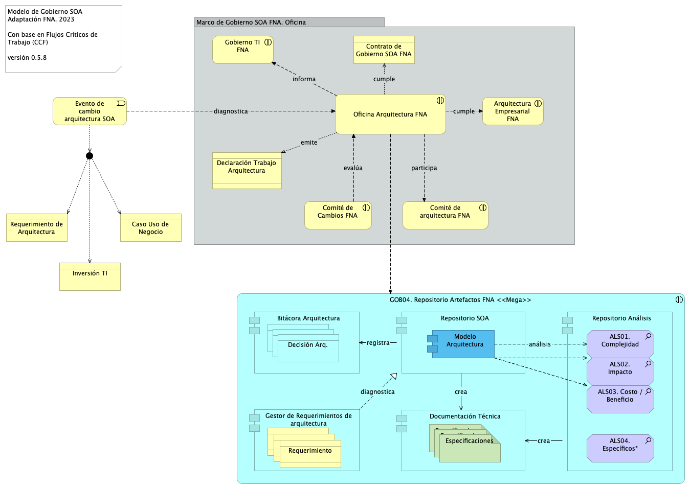

---
title: Vista de Contexto
geometry:
  - top=1in
  - bottom=1in
fignos-cleveref: True
fignos-plus-name: Fig.
fignos-caption-name: Imagen
tablenos-caption-name: Tabla
...

| Tema           | Gobierno SOA del FNA: **Modelo de Gobierno y CCF**                                                            |
|----------------|---------------------------------------------------------------------------------------------------------------|
| Palabras clave | SOA, Contexto, Áreas, Procesos, Objetivos                                                                     |
| Autor          |                                                                                                               |
| Fuente         |                                                                                                               |
| Versión        | **1.$COMMIT** del $FECHA_COMPILACION                                                                          |
| Vínculos       | [Ejecución Plan de Trabajo SOA](onenote:#N001d.sharepoint.com); [Procesos de Negocio FNA](onenote:#N003a.com) |

 

## Antecedentes del Gobierno SOA del FNA
Los resultados de la consultoría E-Service, Fase I, 2022 señalan la _necesidad de manejo de la complejidad creciente en las soluciones del FNA_ (ver [Resultados E-Service, Fase I](https://stefaninilatam.sharepoint.com/SitePages/Home.aspx)). Sobre esa base, El Fondo Nacional del Ahorro estableció como pilar tecnológico la implementación obligatoria del Gobierno SOA, de forma tal, que preserve la continuidad de servicio y permita identificar y gestionar las amenazas y riesgos que impacten el desarrollo y evolución de las arquitecturas de software del Fondo, tarea base para los planes de alineación y puesta marcha de futuras soluciones y mejoras.

## Modelo de Gobierno SOA del FNA: Actores, Flujos y Procedimientos
El gobierno SOA del FNA, objeto de este proyecto, tiene impacto general en la empresa. Sin embargo, se desarrolla desde un centro condicionado por el alcance de este proyecto. Esta versión del Gobierno SOA del FNA nace en las partes e ítems de la arquitectura de software y de servicios del FNA consignadas en la vista de segmento de la empresa (ver Vista de Contextual, segmento de la empresa, [PR01. E-Service, Fase II](https://https://stefaninilatam.sharepoint.com/SitePages/Home.aspx/fna-dd-f2-pry1/manuscript.pdf)) pero no se queda ahí. Se extiende a actores, a interesados, a usuarios y entidades relacionados con aquellas partes de la arquitectura del FNA.

A cotinuación presentamos el modelo base de gobierno para el FNA, primera edición, versión 0.1. 

## Modelo de Gobierno SOA del FNA. Versión 0.2
La versión inicial del modelo de Gobierno SOA del FNA, propuesto en la Fase I de E-Service establece apenas las bases de lo que debe ser un marco de trabajo para gobierno SOA del FNA. Esta versión hace foco en un asunto general: _responder y gestionar la evolutición de la arquitectura de referencia SOA actual del Fondo Nacional del Ahorro_, y deja para siguientes versiones de este marco de trabajo de gobierno SOA la inclusión de otras problemáticas que demanden mayor gobierno.

{#fig: width=lin}

_Fuente: Diagnóstico SOA. E-Service (2022)._

 

## Modelo de Gobierno SOA del FNA. Versión 0.5
Ahora incorporamos en el modelo de gobierno del FNA el resultado del diagnóstico de susceptibilidad de gobierno realizado sobre los flujos críticos de trabajo elaborados en la Etapa 0 de este proyecto (ver [Flujos Críticos de Trabajo FNA]($(2:{https://stefaninilatam.sharepoint.com/SitePages/Home.aspx}))) con el fin de dar darle gestión a las problemáticas encontradas en dicho diagnóstico. El diagrama siguiente presenta el mopdelo de gobierno resultante. 

La nueva versión del modelo de gobierno del FNA incorpora las problemáticas encontradas en el producto 1 de este proyecto.

{#fig: width=lin}

_Fuente: Elaboración propia._

 

#### Elementos del Modelo de Gobierno, versión 0.5
| Name                                  | Type                    | Description                                                                                                                                                                                                                                                                                                      | Properties |
|:--------------------------------------|:------------------------|:-----------------------------------------------------------------------------------------------------------------------------------------------------------------------------------------------------------------------------------------------------------------------------------------------------------------|:-----------|
| **Bitácora Arquitectura**             | application-component   |                                                                                                                                                                                                                                                                                                                  |            |
| **Documentación Técnica**             | application-component   |                                                                                                                                                                                                                                                                                                                  |            |
| **Modelo Arquitectura**               | application-component   |                                                                                                                                                                                                                                                                                                                  |            |
| **Repositorio Análisis**              | application-component   |                                                                                                                                                                                                                                                                                                                  |            |
| **Repositorio SOA**                   | application-component   |                                                                                                                                                                                                                                                                                                                  |            |
| **Arquitectura FNA
Mega**        | application-interaction |                                                                                                                                                                                                                                                                                                                  |            |
| **Especificaciones**                  | artifact                |                                                                                                                                                                                                                                                                                                                  |            |
| **Especificaciones**                  | artifact                | Métricas, Conclusiones, Decisiones.                                                                                                                                                                                                                                                                        |            |
| **ALS01. Complejidad**                | assessment              |                                                                                                                                                                                                                                                                                                                  |            |
| **ALS02. Impacto**                    | assessment              |                                                                                                                                                                                                                                                                                                                  |            |
| **ALS03. Costo / Beneficio**          | assessment              |                                                                                                                                                                                                                                                                                                                  |            |
| **Evento de cambio arquitectura SOA** | business-event          | Sucede un evento en que la arquitectura SOA, o alguna de los componentes de la arquitectura de referencia del FNA es imputado por un cambio. El cambio puede ser motivado por un requerimiento de arquitectura (TOGAF), una necesidad de negocio, o la adquisición de infraestructura (inversión de TI). |            |
| **Arquitectura Empresarial FNA**      | business-interaction    |                                                                                                                                                                                                                                                                                                                  |            |
| **Comité de Cambios FNA**             | business-interaction    |                                                                                                                                                                                                                                                                                                                  |            |
| **Comité de arquitectura FNA**        | business-interaction    |                                                                                                                                                                                                                                                                                                                  |            |
| **Gobierno TI FNA**                   | business-interaction    |                                                                                                                                                                                                                                                                                                                  |            |
| **Oficina Arquitectura FNA**          | business-interaction    |                                                                                                                                                                                                                                                                                                                  |            |
| **Caso Uso de Negocio**               | business-object         |                                                                                                                                                                                                                                                                                                                  |            |
| **Inversión TI**                      | business-object         |                                                                                                                                                                                                                                                                                                                  |            |
| **Requerimiento de Arquitectura**     | business-object         |                                                                                                                                                                                                                                                                                                                  |            |
| **Contrato de Gobierno SOA FNA**      | contract                |                                                                                                                                                                                                                                                                                                                  |            |
| **Decisión**                          | data-object             |                                                                                                                                                                                                                                                                                                                  |            |
| **Decisión Arq.**                     | data-object             |                                                                                                                                                                                                                                                                                                                  |            |

 

Una vez definido esta nueva versión del modelo de gobierno del FNA, debemos dotarlo de un sentido operativo mediante objetivos y funciones del gobierno a los que este modelo debe ceñirse y responder.

 

