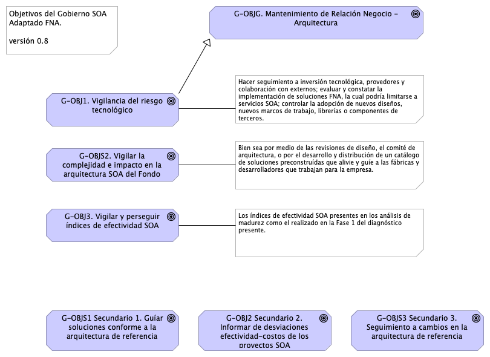

---
title: Modelo de Gobierno. Detalle de los recursos, herramientas, roles y participantes del gobierno SOA
geometry:
  - top=1in
  - bottom=1in
fignos-cleveref: True
fignos-plus-name: Fig.
fignos-caption-name: Imagen
tablenos-caption-name: Tabla
...

| Tema           | Modelo de Gobierno SOA. v0.5: **Objetivos, Capacidades y Funciones del Gobierno** |
|----------------|--------------------------------------------------------------------------------|
| Palabras clave | SOA, Contexto, Áreas, Procesos, Objetivos                                      |
| Autor          |                                                                                |
| Fuente         |                                                                                |
| Versión        | **1.$COMMIT** del $FECHA_COMPILACION                                           |
| Vínculos       | [Ejecución Plan de Trabajo SOA](onenote:#N001d.sharepoint.com); [Procesos de Negocio FNA](onenote:#N003a.com)|

 

## Definición de Objetivos, Funciones y Capacidades del Gobierno SOA
Dado los niveles de complejidad que el FNA ha alcanzado y por los riesgos tecnológico que contraen las partes analizadas en la Fase 1 de este diagnóstico (ver [04b.Resumen Fase 1](N03a%a20Vsta%20aSegenta%20SOA%20FNA.md)), esto es, aplicaciones, servicios, procesos, infraestructura, entre otros, la figura de gobierno SOA es de carácter obligatorio en el Fondo. Esta sirve además para  complementar los procedimientos de TI del Fondo (ver anexo 1, [06n. Anexos](N03a%a20Vsta%20aSegenta%20SOA%20FNA.md)).

De las problemáticas encontradas en la Fase 1 del presente diagnóstico, nos estamos refiriendo explícitamente a las que incrementan la complejidad de las herramientas de software y soluciones tecnológicas del FNA, _como lo es el manejo de dependencias de los servicios SOA del Fondo_. Es muy conocido, y demostrado, que solo esta condición es la causa de la mayoría de los sobreesfuerzos en los cambios y de la dificultades a la hora de predecir su impacto.

Junto a esta complicación, que de por sí hace obligatoria la introdución de la figura del gobierno SOA en el Fondo, y que organizaciones como el OpenGroup señalan que se dan por la falta de Arquitectura Empresarial, y por consiguiente, por un débil gobierno, se encuentran otras que fueron levantadas en la Fase 1 del presente diagnóstico: agilidad limitada, complejidad e imprecisión en la trazabilidad, ocultamiento de funcionalidades (ver [04b.Resumen Fase 1](N03a%a20Vsta%20aSegenta%20SOA%20FNA.md)).

 

### Objetivos Principales del Gobierno SOA del FNA
Una vez identificadas estas problemáticas de orden mayor existentes en la empresa y que podemos resumir en tres: riesgo tecnológico, complejidad y nivel de adopción SOA presente en los desarrollos e implementaciones del FNA, el gobierno SOA propuesto para el Fondo tiene un objetivo general que es el siguiente.

> El gobierno SOA es el vigía de las relaciones entre las áreas de negocio (la vicepresidencia de operaciones y la vicepresidencia de crédito del FNA) y la implementación y diseño de soluciones SOA. El gobierno SOA del Fondo debe asistir en la aplicación y ejecución de un régimen (estándar) de implementación, observación y puesta en marcha de soluciones SOA.

 

Como objetivos específicos principales debe incluir, como mínimo, los siguientes:

{width="12in" height="7in"}
[Imagen.]() Objetivos principales del gobierno SOA del FNA.

_Fuente: elaboración propia._

 

1. G-OBJ1. Vigilancia del riesgo tecnológico en tres vías. Primero, hacer seguimiento a la inversión tecnológica, el cual involucra a los provedores del FNA y colaboración con externos; segundo, evaluar y constatar la implementación de herramientas de software, la cual podría limitarse a servicios SOA; y finalmente, controlar la adopción de nuevos diseños, nuevos marcos de trabajo, librerías o componentes de terceros.

   Del objetivo anterior (Vigilancia del riesgo tecnológico) se desprende este para enfatizar el control sobre la inversión de TI: vigilar la efectividad y factibilidad de los proyectos SOA de la organización en términos del área de efectividad del costo y factibilidad SOA. Ambos conceptos explicados en [Supervisión de efectividad y factibilidad SOA](N03a%a20Vsta%20aSegenta%20SOA%20FNA.md).
1. G-OBJ2. Vigilar el crecimiento de la complejidad y el impacto de los nuevos cambios en la arquitectura de referencia SOA del Fondo, bien sea por medio de las revisiones de diseño, el comité de arquitectura, o por el desarrollo y distribución de un catálogo de soluciones preconstruídas que alivie y guíe a las fábricas y desarrolladores que trabajan para la empresa.
1. G-OBJ3. Vigilar y perseguir el aumento de los índices de adopción, adaptación y efectividad SOA presentes en los análisis de madurez como el realizado en la Fase 1 del diagnóstico presente (ver [02.Fase 2 PR2 Estudio Madurez SOA FNA](N03a%a20Vsta%20aSegenta%20SOA%20FNA.md)). Poner el marcha el proceso de gobierno SOA del FNA descrito más adelante en este ejercicio (181-2020). Adaptar y monitorear los índices de rendimiento (KPI) del proceso.

 

### Otros Objetivos del Gobierno SOA
Para complementar la lista de objetivos del gobierno SOA recomendados por este diagnóstico al Fondo, la lista siguiente expone objetivos que pueden ser conseguidos de forma indirecta, o con la mediación de proyectos transformadores, como la Arquitectura Empresarial, transformación digital, arquitectura de negocio, entre otros.

1. Desde el área, o rol, de gobierno SOA del FNA, servir de guía en la entrega de soluciones de software conforme a la arquitectura de referencia estregada por esta consultoría.
1. Informar de desviaciones en la relación de efectividad de costos de los proyectos SOA del FNA (en términos del área de inefectividad de costo e infactibilidad SOA.
1. Hacer el seguimiento de las implementaciones de los cambios en la arquitectura de referencia: phase G, Implementation Governance, TOGAF ADM.

 

La imagen siguiente preesenta el conjunto de objetivos principales y secundarios que el Gobierno SOA del FNA, versión 0.5, debe perseguir y cumplir. 

{#fig: width=lin}

_Fuente: Diagnóstico SOA. E-Service (2022)_

 

#### G-OBJ1. Vigilancia del Riesgo Tecnológico
La definición de riesgos tecnológico que perseguimos en este ejercicio de diseño de gobierno SOA tiene que ver únicamente con los dominios de arquitectura[^1], a los que estos impacten. Esta clasificación de los riesgos técnicos, y para efectos del ejercicio de gobierno objeto de este proyecto, es eficaz porque le facilita a cada arquitecto focalizar y mitigar aquellos riesgos relacionados con su dominio particular, que en este contexto consideramos como dominios de arquitectura a: servicios, aplicaciones, datos e infraestructura. Los riesgos transversales, como los causados por la deuda técnica, los clasificaremos en el dominio de servicios.

[^1]: TOGAF 9.1. Risk Management (2023): En https://pubs.opengroup.org/architecture/togaf9-doc/arch/chap27.html

##### Niveles de Riesgo Técnico para del FNA
Aún cuando tengamos la clasificación de riesgos técnicos, requerimos contar con niveles de criticidad a los riesgos técnicos (organizados por dominio de arquiteura). Los niveles que consideramos pertinentes para este trabajo de gobierno SOA del FNA son riesgo de nivel inicial y nivel residual.

La definición de cada nivel de riesgo es como sigue.
* Riesgo Técnico Inicial: nivel de riesgo al momento de su identificación en las arquitecturas del FNA. El riesgo permanece en este nivel antes y durante la implementación de las acciones de mitigación.
* Riesgo Técnico Reisudal: este nivel que toma el riesgo técnico luego de la implementación de las acciones de mitigación. 

  Hacer seguimiento a inversión tecnológica, provedores y colaboración con externos; evaluar y constatar la implementación de soluciones FNA, la cual podría limitarse a servicios SOA; controlar la adopción de nuevos diseños, nuevos marcos de trabajo, librerías o componentes de terceros.

#### G-OBJS2. Vigilar la Complejidad e Impacto en la Arquitectura SOA del Fondo
Bien sea por medio de las revisiones de diseño, el comité de arquitectura, o por el desarrollo y distribución de un catálogo de soluciones preconstruídas que alivie y guíe a las fábricas y desarrolladores que trabajan para la empresa.

#### G-OBJ3. Vigilar y Alcanzar los Índices de Efectividad SOA
Los índices de efectividad SOA presentes en los análisis de madurez como el realizado en la Fase 1 del diagnóstico presente.

 

## Funciones del Gobierno SOA del FNA
1. Equilibrio arquitectura y procesos SOA
1. Supervisión de efectividad y factibilidad SOA
1. Mejora de los índices de efectividad (madurez) SOA
1. Consideraciones para la puesta en marcha del gobierno SOA en el FNA

