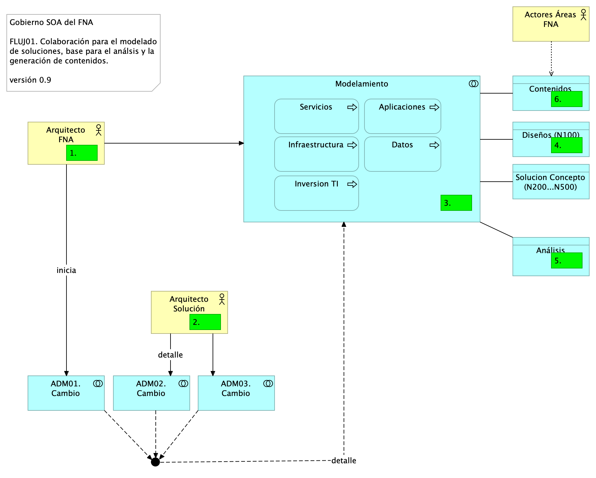

---
geometry:
  - top=1in
  - bottom=1in
fignos-cleveref: True
fignos-plus-name: Fig.
fignos-caption-name: Imagen
tablenos-caption-name: Tabla
...

| Tema           | Modelo de Gobierno SOA. v0.5: **Flujos de Trabajo Oficina de Arquitectura** |
|----------------|--------------------------------------------------------------------------------|
| Palabras clave | SOA, Contexto, Áreas, Procesos, Objetivos, Flujo de trabajo                    |
| Autor          |                                                                                |
| Fuente         |                                                                                |
| Versión        | **1.$COMMIT** del $FECHA_COMPILACION                                           |
| Vínculos       | [Ejecución Plan de Trabajo SOA](onenote:#N001d.sharepoint.com); [Procesos de Negocio FNA](onenote:#N003a.com)|

 

Desarrollamos a continuación dos flujos fundamentales de la oficina de arquitectura. El primero, el FLUJ01. Diseño y Análisis de Modelos de Arquitectura del FNA, se ejecuta cada vez que exista una petición de requerimiento de cambio de arquitectura. Los demás pasos de este flujo se resumen a continuación.

1. Recibe el requerimiento de arquitectura
1. Inicia el proceso ADM - fase de preliminar: alistamiento y aprobación​
1. Inicia el modelado​
1. Continúa el proceso ADM - solicita implementación / gobierno

La siguiente imagen ilustra los pasos descritos.

[Imagen 3.]() Actividades y relaciones de los estados de un flujo de trabajo de la oficina de arquitectura con arreglo al proceso ADM de TOGAF. Flujo recomendado para la oficina de arquitectura del FNA.

_Fuente: elaboración propia._

Una variante del flujo de trabajo arquitectura ADM, y más sgnificativa para el FNA, incorpora los tipos de análisis que dentro del flujo se llevan a cabo.

1. Arq1 recibe el cambio
1. Inicia el proceso ADM - fase de preliminar: alistamiento y probación
1. Inicia el modelado
    1. Creación de contenidos
    1. Diseño
        1. Inicia diseño conceptual (nivel 100): appl, datos, TI, servicios, inversión
        1. Bloques de construcción abstractos
    1. Solución
        1. Bloques de construcción de solución
        1. Solicita diseño detallado (nivel 200, 300, 400 o 500): appl, datos, técnica, servicios
    1. Inicia análisis
        1. Impacto
        1. Costo / beneficio
        1. Plan de cambios
        1. Estimación
        1. Complejidad
        1. Estructural
        1. Otros
1. Solicita al Arq solución el inicio del proceso ADM - fases de implementación / gobierno

 
