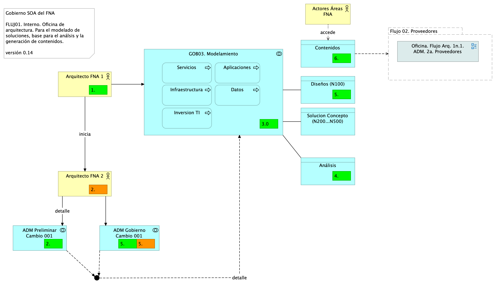

---
geometry:
  - top=1in
  - bottom=1in
fignos-cleveref: True
fignos-plus-name: Fig.
fignos-caption-name: Imagen
tablenos-caption-name: Tabla
...

| Tema           | Modelo de Gobierno SOA. v0.5: **Flujos de Trabajo Oficina de Arquitectura**  |
|----------------|-------------------------------------------------------------|
| Palabras clave | SOA, Contexto, Áreas, Procesos, Objetivos, Flujo de trabajo |
| Autor          |                                                             |
| Fuente         |                                                             |
| Versión        | **1.$COMMIT** del $FECHA_COMPILACION                        |
| Vínculos       | [Ejecución Plan de Trabajo SOA](onenote:#N001d.sharepoint.com); [Procesos de Negocio FNA](onenote:#N003a.com) |

 

# Flujos de Trabajo Oficina de Arquitectura
El flujo de trabajo de la oficina de arquitectura es un mecanismo de prevención de las carencias de gobierno 0.2 del FNA (ver [Análisis de suseptibilidad de gobierno (PR01)](../../fna-dd-f2-pry1/content/01a3.flujos.md), y [Anexo 1. Susceptibilidades de Gobierno (PR01)](https://stefaninilatam.sharepoint.com/SitePages/Home.aspx)), al refinar el proceso de colaboración y autoría de modelos, lo mismo, que al tomar como base del trabajo al repositorio de arquitectura del FNA. El flujo de trabajo de arquitectura resalta los roles y responsabilidades de los participantes: arquitectos FNA, arquitectos solución (proveedores), administradores del repositorio de arquitectura, revisores y aprobadores, y audiencia objetivo de los resultados del trabajo.

Para cubrir los casos más significativos del análisis de susceptibilidad de gobierno, hemos creado los flujos de trabajo interno, y su alternativa, el de proveedores, definidos para priorizar la atención a tales problemas. Los problemas de gobierno referidos son

## Susceptibilidades de Gobierno (PR01)
1. Debilidad en la Completitud de los CU
1. Herramientas y Métodos de QA relacionados con sistemas distribuidos y QA​
1. Normalización y fortalecimiento de los ambientes QA ​
1. Gestión del diseño y arquitecturas: categorización de complejidad​
1. Correspondencia complejidad - diseño
1. Débil (o inexistente) procedimiento de evaluación de inversión​
1. Débil (o inexistente) formalidad para el cálculo de eficacia un inversión​ TI, proveedores
1. Normnalizar registro de resultados de las entregas de proveedores​ (confiabilidad)
1. Asignación de responsables de gestión de las inversiones de TI

 

Adicional a estas, existen otras problemáticas inherentes ya no al Gobierno, si no a la colaboración y autoría de modelos de arquitectura. Estas problemáticas, que las llamaremos de colaboración, también son abordadas por los flujos de trabajo diseñados para la oficina de arquitectura del FNA.

## Problemáticas de Colaboración
Existen tres problemáticas exclusivas de la creación de modelos, en general, pero que son más cuestionables para los profesionales de arquitectura de de todos los dominios, software, datos, etc. Estas se presnetan en la forma cómo colaboran al momento de documentar, aumentar detalle, o gestionar las versiones de los modelos.

Son señales de problemas de colaboarción en el modelamiento de arquitectura

* **Fragmentación**. Equipos de arquitectura sepadaros en distintas empresas, grupos o divisiones físicas o administrativas y con poca o nada comunicación.
* **Aislammiento**. Áreas de arquitectura trabajando de manera solitaria crean y usan diferentes estilos, estándares, relacionamiento y niveles de detalle de modelamiento.
* **Desapropiamiento**. La falta de autoría de los modelos, de los niveles de detalles y de las decisiones de soporte afecta a los equipos de arquitectura, así como a externos, que no saben a quién dirigirse para entender estos activos.

 

## Flujo de Trabajo Oficina de Arquitectura Interno (FLUJ01)
Desarrollamos dos flujos fundamentales de la oficina de arquitectura. El primero, el FLUJ01. Diseño y Análisis de Modelos de Arquitectura del FNA, se ejecuta cada vez que exista una petición de requerimiento de cambio de arquitectura. Los demás pasos de este flujo se resumen a continuación.

1. Recibe el requerimiento de arquitectura
    * Inicia el proceso ADM - Fase de preliminar: alistamiento y aprobación​
    * Arranca el modelado​ inicial o incremental, nivel 100 [^1]
1. El arquitecto de solución continúa el proceso ADM - solicita implementación / gobierno

[^1]: Niveles de detalle de la ingeniería: https://editeca.com/lod-nivel-de-desarrollo/

 

La siguiente imagen ilustra los pasos descritos.

{#fig: width=}

_Fuente: Elaboración propia._

 

El flujo interno tiene un propósito acotado a los asuntos concernientes a los involurados de la oficina de arquitectura, adscrita a la vicepresidencia de tecnología del FNA. No debe, por tanto, dar alcance a los trabajos que se estén realizando con otras oficinas del Fondo, como por ejemplo Planeación, o con arquitectos externos, proveedores o fábricas de software. De esto último es presisamente de lo que se encarga el flujo no. 2, Flujo de Trabajo Oficina de Arquitectura Proveedores, descrito más adelante. El flujo interno de la oficina puede sin embargo, y con mucha frecuencia lo hará, dar inicio a un flujo 2, que de colaboración entre oficinas y proveedores y fábricas se trata.

 

## Flujo de Trabajo Oficina de Arquitectura Proveedores (FLUJ02)
Una variante del flujo de trabajo arquitectura ADM, y más sgnificativa para el FNA, incorpora los tipos de análisis que se deben llevar a cabo, como exigencia del gobierno que estamos instalando.

1. El Arq. FNA recibe el requerimientos de cambio
1. Inicia el proceso ADM - fase de preliminar: alistamiento y probación
1. Inicia el modelado
    1. Diseño
        1. Inicia diseño conceptual (nivel 100): appl, datos, TI, servicios, inversión
        1. Bloques de construcción abstractos
    1. Solución
        1. Bloques de construcción de solución
        1. Solicita diseño detallado (nivel 200, 300, 400 o 500) de los dominios de arquitectura: aplicaciones, datos, infraestructura y servicios
1. El Arquitecto FNA inicia los análisis mínimos
    1. Análisis de impacto
    1. de Complejidad
    1. y Costo / beneficio
1. El Arquitecto FNA (de la oficina de arquitectura) solicita al arquitecto de solución, sea de proveedor interno o externo, el inicio del Proceso ADM - fase de implementación y fase de gobierno
    1. El arquitecto de solución modela los bloques de solución [^2]

1. El Arquitecto FNA inicia la creación de contenidos y _documentación técnica_
    
       Nota. Otros análisis exigibles también a los arquitectos de solución: Plan de cambios, Estimación, Estructural.

[^2]: ABB y CBB, TOGAF 9.1. Características generales. En https://pubs.opengroup.org/architecture/togaf9-doc/arch/chap33.html.

### Catálogo de Elementos del Flujo de Trabajo 

| Nombre                                         | Tipo                      | Descripción                                                                                                         |
|:-----------------------------------------------|:--------------------------|:--------------------------------------------------------------------------------------------------------------------|
| **ADM Gobierno Cambio 001**                    | application-collaboration |                                                                                                                     |
| **ADM Implementación Cambio 001**              | application-collaboration |                                                                                                                     |
| **ADM Preliminar Cambio 001**                  | application-collaboration |                                                                                                                     |
| **GOB03. Modelamiento**                        | application-collaboration |                                                                                                                     |
| **GOB04. Repositorio Artefactos FNA <<Mega>>** | application-interaction   |                                                                                                                     |
| **Aplicaciones**                               | application-process       |                                                                                                                     |
| **Datos**                                      | application-process       |                                                                                                                     |
| **Infraestructura**                            | application-process       |                                                                                                                     |
| **Inversion TI**                               | application-process       |                                                                                                                     |
| **Servicios**                                  | application-process       |                                                                                                                     |
| **Actores Áreas FNA**                          | business-actor            |                                                                                                                     |
| **Arquitecto FNA**                             | business-actor            |                                                                                                                     |
| **Arquitecto Solución**                        | business-actor            |                                                                                                                     |
| **GOB01. Colaboración entre Oficinas**         | business-collaboration    |                                                                                                                     |
| **Análisis**                                   | data-object               | Análisis de impacto, complejidad, plan de cambios, estimaciones, costo / b.                                      |
| **Bloques de Solucion (N200...500)**           | data-object               |                                                                                                                     |
| **Contenidos**                                 | data-object               | Presentaciones, Diagramas, Textos, Matrices, Listas, Catálogos, Estimaciones.                                       |
| **Diseños (N100)**                             | data-object               | Diseños de nivel 100. Conceptuales. Necesarios para insumo de análisis de impacto, complejidad y costo / beneficio. |

 

## Bloques de Construcción Requeridos por Arquitectura (LAOF)
Los bloques de solución a los que nos referimos en el paso del arquitecto de solución son paquetes de funcionalidad definidos por necesidades de negocio o del arquitecto. Pueden ser cualquier clasificador (objeto tipo) correspondiente al modelo de contenidos de la empresa, como por ejemplo, actores, servicios, aplicaciones, o entidades de datos. Representan un único concepto que tiene límites claros y es reconocible como 'parte' en un dominio de la arquitectura. Puede o no interoperar con otros bloques. Es importante que un bloque de construcción tenga una implementación y un uso. Debe además evolucionar mediante la tecnología. 

Los bloques de solución pueden estar compuesto por otros (ensamblado), y por tanto, puede ser descompuesto (desensamblado) en los bloques pequeños que los constituyen. Es obligatorio que sea reutilizable, reemplazable, y especificado a conformidad.

Los sistemas y herramientas de software de la arquitectura del FNA deben estar creados a partir de colecciones de bloques de solución. De ahí que estos bloques deban tener una interfaz de interacción clara y estable para con otros bloques. 

Lo más importante de estos bloques es que son los que contienen los niveles de detalle (100 al 500). Por ejemplo, a nivel 100, el arquitecto del FNA podría dar comiezo al modelado de un bloque de solución mediante un nombre, una descripción o un esquema. Luego, el arquitecto de solución, puede descomponer este mismo bloque en múltiples construcciones acompañada de una especificación más detallada (nivel 200 al 500).

En la siguiente imagen ilustramos esta variante del flujo de trabajo de la oficina de arquitectura del FNA.

{#fig: width=}

_Fuente: Elaboración propia._

 

El flujo 2, que atiende la colaboración entre oficinas de arquitecturas, bien puede ser iniciado por un flujo interno de la oficina del FNA, (FLUJ01, Flujo de Trabajo Oficina de Arquitectura Interno). Es frecuente que una implementación iniciada por el este flujo (2 le correponda una revisión interna, y de esta, se inicien varios flujos de implementación y colaboración de ambios a los servicios y aplicaciones del FNA.
