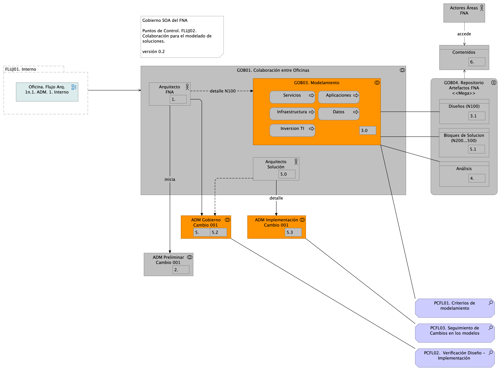

# Puntos de Control del Flujo de Trabajo de la Oficina FNA
Los flujos antes descritos, interno y el de colaboración, deben contar con puntos de control diseñados específicamente para atender a las problemáticas mencionadas en [Problemáticas de arquitectura](#problematicas).

    Nota: existen tres problemáticas exclusivas de la creación de modelos: Fragmentación, Aislammiento y Desapropiamiento. Estos problemas de modelamiento se presentan en la forma cómo colaboran los arquitectos al momento de documentar, detallar, y versionar los modelos.

 

## Punto de Control 1. Criterios de Modelamiento Divergentes
El repositorio de arquitectura es el depósito visible de todos los activos modelados del FNA. La autoría de los modelos requiere el cumplimiento de reglas de modelamiento, como nomenclaturas y códigos que sinteticen la información y faciliten posteriormente su comunicación. Son reglas edición que pueden ser evidenciadas y ejercitadas mediante las herramientas de validación de modelos, facilidad a cargo de la herramienta con la que se implemente el repositorio de arquitectura del FNA.

Las reglas de edición deben ser extendidas o removidas en la medida necesaria. La Oficina de rquitectura del FNA es la responsable de esta actividad.

## Punto de Control 2. Verificación Diseño - Implementación
La actividad ADM Gobierno Cambio 001 (actividad no. 5.0 y 5.1 en el diagrama [Flujo de Trabajo Oficina de Arquitectura Proveedores (FLUJ02)]) del flujo de colaboración/implementación es la llamada a realizar este control. Además de las actividades que se llevan a cabo en el interno de esta, debe realizar además las labores de verificación de la implementación siguiendo para ellos los mecanismos, y usando los dispoitovos de control que la Oficina de Arquitetura del Fondo disponga para este propósito.

## Punto de Control 3. Seguimiento de Cambios en los modelos

* **Fragmentación**. Equipos de arquitectura sepadaros en distintas empresas, grupos o divisiones físicas o administrativas y con poca o nada comunicación.
* **Aislammiento**. Áreas de arquitectura trabajando de manera solitaria crean y usan diferentes estilos, estándares, relacionamiento y niveles de detalle de modelamiento.
* **Desapropiamiento**. La falta de autoría de los modelos, de los niveles de detalles y de las decisiones de soporte afecta a los equipos de arquitectura, así como a externos, que no saben a quién dirigirse para entender estos activos.

{#fig: width=}

_Fuente: Diagnóstico SOA. E-Service (2022)._

 

 
