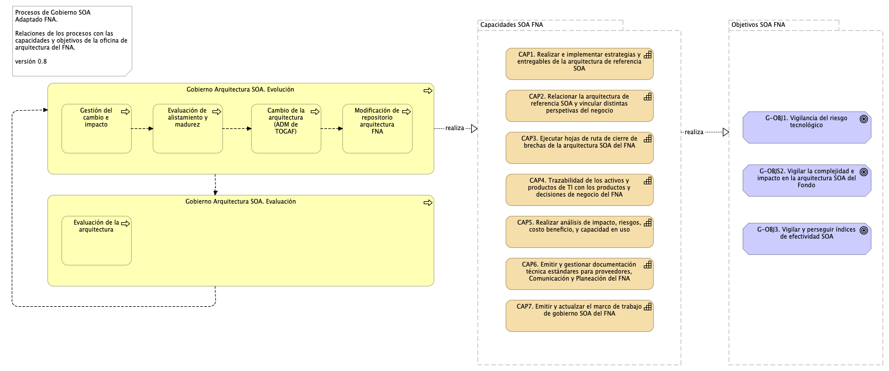

---
title: Modelo de Gobierno. Detalle de los recursos, herramientas, roles y participantes del gobierno SOA
geometry:
  - top=1in
  - bottom=1in
fignos-cleveref: True
fignos-plus-name: Fig.
fignos-caption-name: Imagen
tablenos-caption-name: Tabla
...

| Tema           | Modelo de Gobierno SOA. v0.5: **Procedimientos base del modelo de gobierno / oficina de arquitectura** |
|----------------|--------------------------------------------------------------------------------|
| Palabras clave | SOA, Contexto, Áreas, Procesos, Objetivos                                      |
| Autor          |                                                                                |
| Fuente         |                                                                                |
| Version        | 1.$COMMIT del $FECHA_COMPILACION                                               |
| Vínculos       | [Ejecución Plan de Trabajo SOA](onenote:#N001d.sharepoint.com); [Procesos de Negocio FNA](onenote:#N003a.com)|

 

# Procedimientos del Modelo de Gobierno del FNA
Por último, el proceso de gobierno SOA es la conjugación de las dos consideraciones anteriores aquí presentadas, el marco de trabajo (acciones y herramientas) y el equipo de trabajo, que traeidos al contexto del FNA son los recursos de capital humano y la manera cómo deben operar. Este proceso adaptado al FNA busca alcanzar los objetivos SOA determinados por este diagnóstico. (ver imagen abajo)

{#fig: width=}

_Fuente: elaboración propia._

 

El proceso de gobierno SOA está en línea y apoya a las capacidades SOA que el FNA debe implementar. Al alinear las capacidades SOA con este proceso aseguramos que se persigan los objetivos SOA establecidos por esta consultoría.

Por otro lado, esta implementaión de Gobierno SOA debe ser un proceso más del Fondo, no es un proyecto. En este sentido, los pasos de este proceso son un bucle activo de mejora continua, y debe hacer parte del mapa de calidad del Fondo (como uno más de los procesos operativos existentes).

Una vista de conjunto pone en perspectiva el rol de los procesos de la oficina de arquitectura frente a las capacidades que estos soportan, y los objetivos a los que propende y que se sostienen en las capacidades.

{#fig: width=}

_Fuente: elaboración propia._

 

