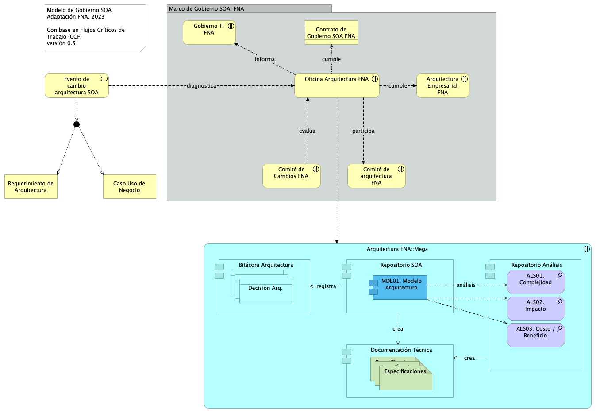

title: Vista de Contexto
geometry:
  - top=1in
  - bottom=1in
fignos-cleveref: True
fignos-plus-name: Fig.
fignos-caption-name: Imagen
tablenos-caption-name: Tabla
...

| Tema           | Vista de Contexto: **Elementos de la Arquitectura Impactados por el Proyecto** |
|----------------|--------------------------------------------------------------------------------|
| Palabras clave | SOA, Contexto, Áreas, Procesos, Objetivos                                      |
| Autor          |                                                                                |
| Fuente         |                                                                                |
| Version        | **1.6792c0b** del 13 Jun 2023                                           |
| Vínculos       | [N001d. Ejecución Plan de Trabajo SOA](onenote:#N001d.sharepoint.com); [N003a. Procesos de Negocio FNA](onenote:#N003a.%20Procesos%20de%20Negocio%20FNA&section)|

 

## Antecedentes del Gobierno SOA del FNA
Los resultados de la consultoría E-Service, Fase I, 2022 señalan la _necesidad de manejo de la complejidad creciente en las soluciones del FNA_ (ver [Resultados E-Service, Fase I](https://stefaninilatam.sharepoint.com/SitePages/Home.aspx)). Sobre esa base, El Fondo Nacional del Ahorro estableció como pilar tecnológico la implementación obligatoria del Gobierno SOA, de forma tal, que preserve la continuidad de servicio y permita identificar y gestionar las amenazas y riesgos que impacten el desarrollo y evolución de las arquitecturas de software del Fondo, tarea base para los planes de alineación y puesta marcha de futuras soluciones y mejoras.

## Modelo de Gobierno SOA del FNA: Actores, Flujos y Procedimientos
El gobierno SOA del FNA, objeto de este proyecto, tiene impacto general en la empresa. Sin embargo, se desarrolla desde un centro condicionado por el alcance de este proyecto. Esta versión del Gobierno SOA del FNA nace en las partes e ítems de la arquitectura de software y de servicios del FNA consignadas en la vista de segmento de la empresa (ver Vista de Contextual, segmento de la empresa, [PR01. E-Service, Fase II](https://https://stefaninilatam.sharepoint.com/SitePages/Home.aspx/fna-dd-f2-pry1/manuscript.pdf)) pero no se queda ahí. Se extiende a actores, a interesados, a usuarios y entidades relacionados con aquellas partes de la arquitectura del FNA.

A cotinuación presentamos el modelo de gobierno para el FNA, primera edición, versión 0.1. 

## Modelo de Gobierno SOA del FNA. Versión 0.2
La versión inicial del modelo de Gobierno SOA del FNA, propuesto en la Fase I de E-Service establece apenas las bases de lo que debe ser un marco de trabajo para gobierno SOA del FNA. Esta versión hace foco en un asunto general: _responder y gestionar la evolutición de la arquitectura de referencia SOA actual del Fondo Nacional del Ahorro_, y deja para siguientes versiones de este marco de trabajo de gobierno SOA la inclusión de otras problemáticas que demanden mayor gobierno.

{#fig: width=lin}

_Fuente: Diagnóstico SOA. E-Service (2022)._

 

## Modelo de Gobierno SOA dek FNA. Versión 0.5
Ahora incorporamos en el modelo de gobierno del FNA el resultado del diagnóstico de susceptibilidad de gobierno realizado sobre los flujos críticos de trabajo elaborados en la Etapa 0 de este proyecto (ver [Flujos Críticos de Trabajo FNA]($(2:{https://stefaninilatam.sharepoint.com/SitePages/Home.aspx}))) con el fin de dar darle gestión a las problemáticas encontradas en dicho diagnóstico. El diagrama siguiente presenta el mopdelo de gobierno resultante. 

La nueva versión del modelo de gobierno del FNA incorpora las problemáticas encontradas en el producto 1 de este proyecto.

{#fig: width=lin}

_Fuente: Elaboración propia._

 

Susceptibilidades de gobierno: 
1. Debilidad en la Completitud de los CU
1. Herramientas y Métodos de QA relacionados con sistemas distribuidos y QA​
1. Normalización y fortalecimiento de los ambientes QA ​
1. Gestión del diseño y arquitecturas: categorización de complejidad​
1. Correspondencia complejidad - diseño
1. Débil (o inexistente) procedimiento de evaluación de inversión​
1. Débil (o inexistente) formalidad para el cálculo de eficacia un inversión​ TI, proveedores
1. Normnalizar registro de resultados de las entregas de proveedores​ (confiabilidad)
1. Asignación de responsables de gestión de las inversiones de TI

    Equilibrio arquitectura y procesos SOA
    Supervisión de efectividad y factibilidad SOA
    Mejora de los índices de efectividad (madurez) SOA
    Consideraciones para la puesta en marcha del gobierno SOA en el FNA

### Definición de Objetivos y Capacidades del Gobierno SOA
#### G-OBJ1. Vigilancia del Riesgo Tecnológico
La definición de riesgos tecnológico que perseguimos en este ejercicio de diseño de gobierno SOA tiene que ver únicamente con los dominios de arquitectura[^1], a los que estos impacten. Esta clasificación de los riesgos técnicos, y para efectos del ejercicio de gobierno objeto de este proyecto, es eficaz porque le facilita a cada arquitecto focalizar y mitigar aquellos riesgos relacionados con su dominio particular, que en este contexto consideramos como dominios de arquitectura a: servicios, aplicaciones, datos e infraestructura. Los riesgos transversales, como los causados por la deuda técnica, los clasificaremos en el dominio de servicios.

[^1]: TOGAF 9.1. Risk Management (2023): En https://pubs.opengroup.org/architecture/togaf9-doc/arch/chap27.html

##### Niveles de Riesgo Técnico para del FNA
Aún cuando tengamos la clasificación de riesgos técnicos, requerimos contar con niveles de criticidad a los riesgos técnicos (organizados por dominio de arquiteura). Los niveles que consideramos pertinentes para este trabajo de gobierno SOA del FNA son riesgo de nivel inicial y nivel residual.

La definición de cada nivel de riesgo es como sigue.
* Riesgo Técnico Inicial: nivel de riesgo al momento de su identificación en las arquitecturas del FNA. El riesgo permanece en este nivel antes y durante la implementación de las acciones de mitigación.
* Riesgo Técnico Reisudal: este nivel que toma el riesgo técnico luego de la implementación de las acciones de mitigación. 

  Hacer seguimiento a inversión tecnológica, provedores y colaboración con externos; evaluar y constatar la implementación de soluciones FNA, la cual podría limitarse a servicios SOA; controlar la adopción de nuevos diseños, nuevos marcos de trabajo, librerías o componentes de terceros.

*** 

R1. Riesgo de agilidad limitada (ver imagen 1)
R2. Riesgo de baja orquestación SOA (ver imagen 2a y 2b)
R3. Riesgo de crecimiento de dependencias entre servicios SOA
R4. Riesgo de crecimiento de adaptadores particulares –opuesto al estándar– (ver imagen 3)
R5. Riesgo de baja reutilización de servicios SOA
R6. Riesgo de permanencia de aplicaciones silos
R7. Riesgo de falta de trazabilidad para la evolución e implementación de los servicios SOA

#### G-OBJS2. Vigilar la complejidad e impacto en la arquitectura SOA del Fondo
Bien sea por medio de las revisiones de diseño, el comité de arquitectura, o por el desarrollo y distribución de un catálogo de soluciones preconstruídas que alivie y guíe a las fábricas y desarrolladores que trabajan para la empresa.

#### G-OBJ3. Vigilar y perseguir índices de efectividad SOA
Los índices de efectividad SOA presentes en los análisis de madurez como el realizado en la Fase 1 del diagnóstico presente.

---
title: Vista de Contexto
geometry:
  - top=1in
  - bottom=1in
fignos-cleveref: True
fignos-plus-name: Fig.
fignos-caption-name: Imagen
tablenos-caption-name: Tabla
...

| Tema           | Vista de Contexto: **Elementos de la Arquitectura Impactados por el Proyecto** |
|----------------|--------------------------------------------------------------------------------|
| Palabras clave | SOA, Contexto, Áreas, Procesos, Objetivos                                      |
| Autor          |                                                                                |
| Fuente         |                                                                                |
| Version        | 1.6792c0b del 13 Jun 2023                                               |
| Vínculos       | [Ejecución Plan de Trabajo SOA](onenote:#N001d.sharepoint.com); [Procesos de Negocio FNA](onenote:#N003a.com)|

 

1. Modelo de gobierno SOA del FNA: actores, información y procedimientos

---
title: Vista de Contexto
geometry:
  - top=1in
  - bottom=1in
fignos-cleveref: True
fignos-plus-name: Fig.
fignos-caption-name: Imagen
tablenos-caption-name: Tabla
...

| Tema           | Vista de Contexto: **Elementos de la Arquitectura Impactados por el Proyecto** |
|----------------|--------------------------------------------------------------------------------|
| Palabras clave | SOA, Contexto, Áreas, Procesos, Objetivos                                      |
| Autor          |                                                                                |
| Fuente         |                                                                                |
| Version        | 1.6792c0b del 13 Jun 2023                                               |
| Vínculos       | [Ejecución Plan de Trabajo SOA](onenote:#N001d.sharepoint.com); [Procesos de Negocio FNA](onenote:#N003a.com)|

 

1. Modelo de gobierno SOA del FNA: actores, información y procedimientos

---
title: Vista de Contexto
geometry:
  - top=1in
  - bottom=1in
fignos-cleveref: True
fignos-plus-name: Fig.
fignos-caption-name: Imagen
tablenos-caption-name: Tabla
...

| Tema           | Vista de Contexto: **Elementos de la Arquitectura Impactados por el Proyecto** |
|----------------|--------------------------------------------------------------------------------|
| Palabras clave | SOA, Contexto, Áreas, Procesos, Objetivos                                      |
| Autor          |                                                                                |
| Fuente         |                                                                                |
| Version        | 1.6792c0b del 13 Jun 2023                                               |
| Vínculos       | [Ejecución Plan de Trabajo SOA](onenote:#N001d.sharepoint.com); [Procesos de Negocio FNA](onenote:#N003a.com)|

 

1. Modelo de gobierno SOA del FNA: actores, información y procedimientos

---
title: Vista de Contexto
geometry:
  - top=1in
  - bottom=1in
fignos-cleveref: True
fignos-plus-name: Fig.
fignos-caption-name: Imagen
tablenos-caption-name: Tabla
...

>    E-Service. Fase II
>
>    PRY01 Gobierno SOA. Contenido de los Productos Contractuales
>
>    Contrato 1812020
>
>    FNA, Stefanini
>
>    13 Jun 2023
>
>    **Versión** 1.6792c0b

 

# Producto 3: PR03. Diseño de los Procesos y Responsabilidades del Comité de Gobierno
El comité de gobierno del FNA, PR03 de este proyecto, establece necesaria la participación de la oficina de arquitectura del FNA (LOAF). Este comite sigue algunos de los preceptos y roles del Equipo de Arquitectura Ágil (Disciplined Agile® Architecture DA™). Este comité no sustituye ni supedita a otros existentes en el FNA, tales como el Comité de Control de Cambios, o los que surgen por demás asuntos tecnológicos. Dentro de este comité de gobierno existen roles permitentes a la arquitectura del FNA. Opcionalmente participarán otros roles, como los líderes y grupos de producto (que pueden venir desde otras vicepresidencias del Fondo).

> **Nota 1**: los roles del Comité de Gobierno de Arquitectura no son posiciones dentro del organigrama del FNA.

> **Nota 2**: los análisis de este producto están dirigidos a cumplir los objetivos del proyecto PRY01, Gobierno SOA: desarrollo, gestión, gobierno de arquitectura y adopción.

 

## Justificación
El Comité de Gobierno de Arquitectura captura y gestiona mediante registro en la bitácora de decisiones de arquitectura del FNA las razones, cambios, reformas, transiciones detrás de los requerimientos de arquitectura del FNA (flexibilidad, confiabilidad, rendimiento, mantenibilidad). Comunicará y establecerá responsabilidades directas que de las adaptaciones se deriven a fin de proveer el rastro pertinente a los revisores de estos modificaciones determinadas por el Comité. El Comité de Gobierno de Arquitectura del FNA es, por tanto, la instancia donde se dirimen y dirigen los requerimientos de arquitectura (TOGAF, Architecture Requirement Specification), muchas veces del tipo adaptación o migración tecnológicas, de mayor profundidad y exclusivas de las arquiteturas del FNA.

## Contenidos
1. Modelo operativo del Comité de Gobierno de Arquitecturas del FNA: ámbitos y alcances del comité
1. Consideraciones para la puesta en marcha de la bitácora de decisiones de arquitectura
1. Respositorio y gestión de los requerimientos de arquitectura del FNA (flexibilidad, confiabilidad, rendimiento, mantenibilidad)
1. Métodos de evaluación de arquitecturas para el FNA

 

## Criterios de Aceptación
* Especificaciones de la bitácora de decisiones de arquitectura
* Especificaciones de funcionamiento del Comité de Gobierno de Arquitecturas del FNA
* Esquema de comunicación y publicación de cambios a las arquitecturas del FNA

 

## Modelo de Implementación del PRY01
{#fig: width=lin}

_Fuente: Elaboración propia._

 

*** 

## Referencias {.page_break_before}
<!-- Explicitly insert bibliography here -->

E-Service. Situación SOA Actual del FNA. Etapa I. (2022).

E-Service. Arquitectura de Referencia del FNA. Etapa II. (2023).

E-Service. Hoja de Ruta e Iniciativas. Etapa III. (2023).

TOGAF 9.1. Risk Management (2023). En https://pubs.opengroup.org/architecture/togaf9-doc/arch/chap27.html

