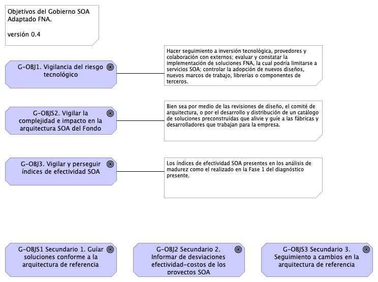
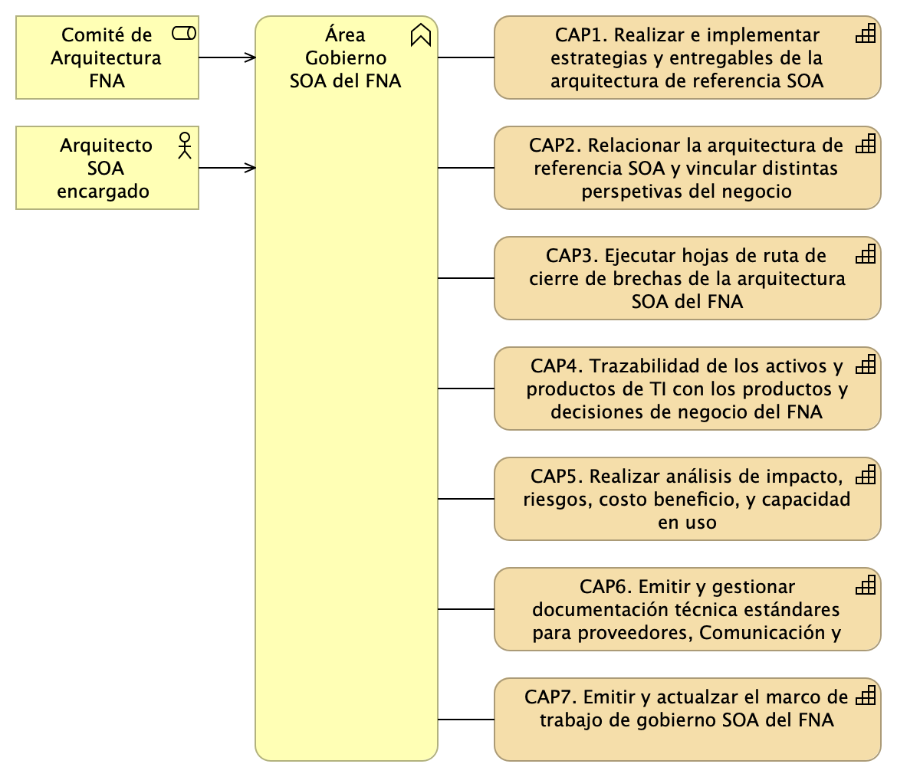
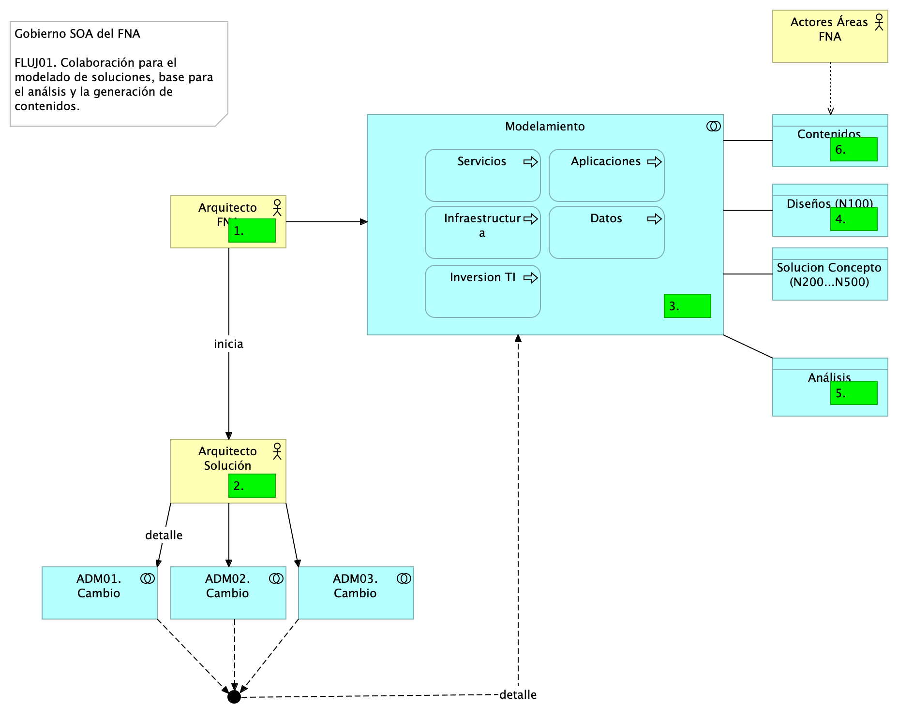
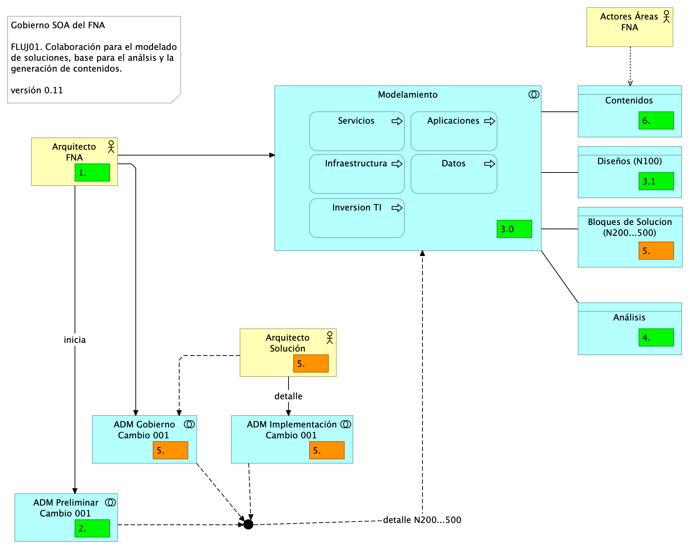
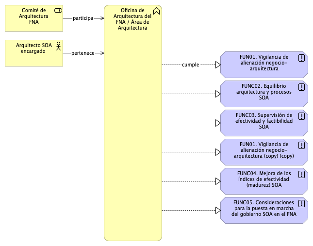
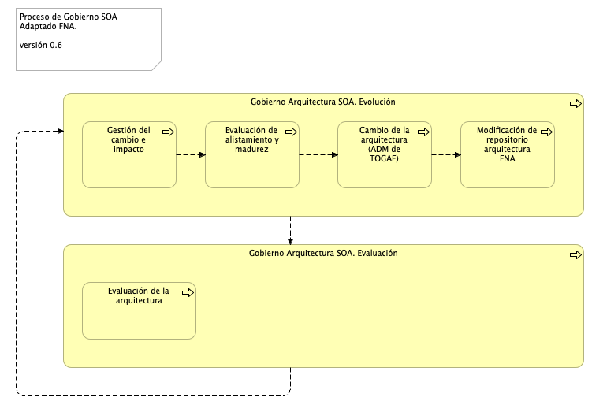
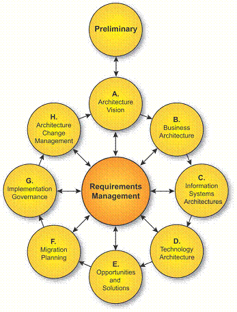
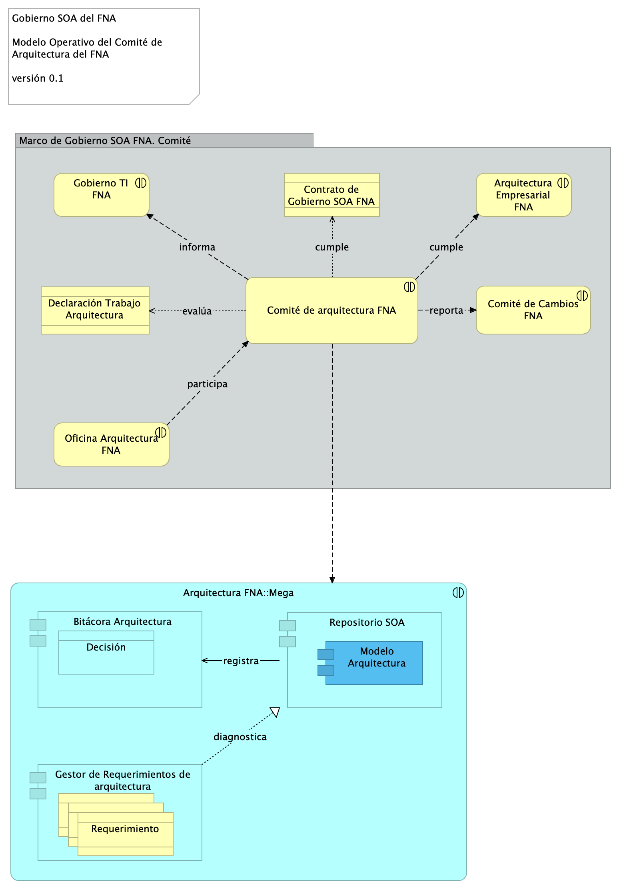

title: Modelo de Gobierno. Detalle de los recursos, herramientas, roles y participantes del gobierno SOA
geometry:
  - top=1in
  - bottom=1in
fignos-cleveref: True
fignos-plus-name: Fig.
fignos-caption-name: Imagen
tablenos-caption-name: Tabla
...

>    E-Service. Fase II
>
>    PRY01 Gobierno SOA. Contenido de los Productos Contractuales
>
>    Contrato 1812020
>
>    FNA, Stefanini
>
>    24 Jun 2023
>
>    **Versión** 1.6e4fb8f

 

# Producto 2: PR02. Modelo de Gobierno. Detalle de los recursos, herramientas, roles y participantes del gobierno SOA
Políticas y procedimiento, paquetes de trabajo, identificación de personas, roles y herramientas a desplegar a cargo de la oficina de arquitectura del FNA por concepto de la instauración del gobierno.

**Nota**: los análisis de este producto están dirigidos a cumplir los objetivos del proyecto PRY01, Gobierno SOA: desarrollo, gestión, gobierno de arquitectura y adopción.

 

## Justificación
El resultados del análisis de riesgos técnicos realizado en la Fase I de la consultoría E-Service, causados en parte por los retos de complejidad y agilidad que enfrenta el FNA, los cuales configuran una red de aplicaciones y servicios que aumenta el impacto, el esfuerzo y la incertidumbre de los cambios en las arquitecturas del Fondo, obliga a crear la oficina de arquitectua del FNA y a desplegar las mejoras en los flujos críticos de trabajo a cargo esta.

## Contenidos
1. Modelo de gobierno SOA del FNA: actores, información y procedimientos
1. Flujo de trabajo de oficina de arquitectura del FNA
1. Matriz de responsabilidades oficina de arquitectura
1. Procedimientos base del modelo de gobierno / oficina de arquitectura
1. Anexos. Referencia documental del Gobierno SOA del FNA

 

## Criterios de Aceptación
* Entendimiento funcional y operativa de la oficina de arquitectura FNA
* Matriz de roles y procedimientos de la oficina de arquitetura FNA

 

## Modelo de Implementación del PRY01
{#fig: width=lin}

_Fuente: Elaboración propia._

 

*** 

---
geometry:
  - top=1in
  - bottom=1in
fignos-cleveref: True
fignos-plus-name: Fig.
fignos-caption-name: Imagen
tablenos-caption-name: Tabla
...

| Tema           | Gobierno SOA del FNA: **Modelo de Gobierno y CCF**                                                            |
|----------------|---------------------------------------------------------------------------------------------------------------|
| Palabras clave | SOA, Contexto, Áreas, Procesos, Objetivos                                                                     |
| Autor          |                                                                                                               |
| Fuente         |                                                                                                               |
| Versión        | **1.6e4fb8f** del 24 Jun 2023                                                                          |
| Vínculos       | [Ejecución Plan de Trabajo SOA](onenote:#N001d.sharepoint.com); [Procesos de Negocio FNA](onenote:#N003a.com) |

 

# Antecedentes del Gobierno SOA del FNA
Los resultados de la consultoría E-Service, Fase I, 2022 señalan la _necesidad de manejo de la complejidad creciente en las soluciones del FNA_ (ver [Resultados E-Service, Fase I](https://stefaninilatam.sharepoint.com/SitePages/Home.aspx)). Sobre esa base, El Fondo Nacional del Ahorro estableció como pilar tecnológico la implementación obligatoria del Gobierno SOA, de forma tal, que preserve la continuidad de servicio y permita identificar y gestionar las amenazas y riesgos que impacten el desarrollo y evolución de las arquitecturas de software del Fondo, tarea base para los planes de alineación y puesta marcha de futuras soluciones y mejoras.

# Modelo de Gobierno SOA del FNA: Actores, Información y Procedimientos
El gobierno SOA del FNA, objeto de este proyecto, tiene impacto general en la empresa. Sin embargo, se desarrolla desde un centro condicionado por el alcance de este proyecto. Esta versión del Gobierno SOA del FNA nace en las partes e ítems de la arquitectura de software y de servicios del FNA consignadas en la vista de segmento de la empresa (ver Vista de Contextual, segmento de la empresa, [PR01. E-Service, Fase II](https://https://stefaninilatam.sharepoint.com/SitePages/Home.aspx/fna-dd-f2-pry1/manuscript.pdf)) pero no se agota ahí porque es necesario extenderlo a actores, interesados, usuarios y entidades relacionados con las partes de la arquitectura del FNA contenidas en la vista de segmento.

A cotinuación presentamos el modelo base de gobierno de arquiteturas SOA para el FNA primera edición, versión 0.1, la manera cómo ha evolucionado en el FNA, y sus elementos de gobierno, los actores, la información que deben generar y las funciones que este postula.

# Modelo de Gobierno SOA del FNA. Versión 0.2
La versión inicial del modelo de Gobierno SOA del FNA, propuesto en la Fase I de E-Service establece apenas las bases de lo que debe ser un marco de trabajo para gobierno SOA del FNA. Esta versión hace foco en un asunto general: _responder y gestionar la evolutición de la arquitectura de referencia SOA actual del Fondo Nacional del Ahorro_, y deja para siguientes versiones de este marco de trabajo de gobierno SOA la inclusión de otras problemáticas que demanden mayor gobierno.

{#fig: width=}

_Fuente: Diagnóstico SOA. E-Service (2022)._

 

Este modelo de gobierno está diseñado para enfrentar el caso particular del FNA que es aumentar la relevancia de los de modelos de arquitectura, que funcionen como lenguaje común entre los autores y actores, y la graduación del uso del repositorio de artefactos de arquitectura e ingeniería. En este modelo de gobierno, v0.5 que diseñamos para la empresa, _el repositorio de arquitectura es el corazón del gobierno_; lo mismo para la oficina del arquitectua del FNA. Es también la base de los análisis de ingeniería que se comparten con proveedores y contratistas del Fondo Nacional del Ahorro.

El requerimiento de arquitectura, sea un Caso de Uso (nivel 0: negocio), una inversión de TI, sea adquisición, migración, consultoría (nivel 1:incidencia), o un requierimiento no funcional (nivel 2:ingeniería), es la entrada principal del modelo de gobierno. 

Una vez definido esta nueva versión del modelo de gobierno del FNA, y descrito sus elementos, debemos dotarlo de un sentido operativo. Esto se hace mediante la declaración de las funciones y objetivos del gobierno a los que este modelo debe ceñirse y responder. De igual manera, los roles que constituyen la oficina de arquitectura del FNA.

 

# Modelo de Gobierno SOA del FNA. Versión 0.5
Ahora incorporamos en el modelo de gobierno del FNA el resultado del diagnóstico de susceptibilidad de gobierno realizado sobre los flujos críticos de trabajo elaborados en la Etapa 0 de este proyecto (ver [Flujos Críticos de Trabajo FNA](https://stefaninilatam.sharepoint.com/SitePages/Home.aspx)) con el fin de dar darle gestión a las problemáticas encontradas en dicho diagnóstico. El diagrama siguiente presenta el mopdelo de gobierno resultante. 

La nueva versión del modelo de gobierno del FNA incorpora las problemáticas encontradas en el producto 1 de este proyecto.

{#fig: width=}

_Fuente: Elaboración propia._

 

## Elementos del Modelo de Gobierno, versión 0.5
Los elementos que describiremos del gobierno de las arquitecturas del FNA en este capítulo son los mínimos que permiten el funcionamiento de esta versión. Definimos Definimos tres categorías con las que organizamos la lista de esos elementos: actores, información y  funciones.

Descripción de los elementos del modelo de gobierno, y categorías en las que están organizados.

| Nombre                                       | Tipo                    | Descripción                                                                                                                                                                                                                                                                                                                                                                                                                                                                                                                                   |
|----------------------------------------------|-------------------------|-----------------------------------------------------------------------------------------------------------------------------------------------------------------------------------------------------------------------------------------------------------------------------------------------------------------------------------------------------------------------------------------------------------------------------------------------------------------------------------------------------------------------------------------------|
| **Bitácora Arquitectura**                    | application-component   | La bitácora de decisiones de arquitectura (ADR, por sus siglas en ingés) es una herramienta para ejercitar el proceso de toma de decisiones de la oficina. Mediante esta es posible estructurar y hacer seguimiento (versión y trazabilidad) a las discusiones de la oficina de arquitectura del FNA. Cumple el objetivo de materializar el consenso elevándolo a un grado oficial, al tiempo que reune a los arquitectos alrededor del mismo contexto, problema, restricciones, conveniencia (pro/con), alternativas y opciones de solución. |
| **Documentación Técnica**                    | application-component   |                                                                                                                                                                                                                                                                                                                                                                                                                                                                                                                                               |
| **Gestor de Requerimientos de arquitectura** | application-component   |                                                                                                                                                                                                                                                                                                                                                                                                                                                                                                                                               |
| **Modelo Arquitectura**                      | application-component   |                                                                                                                                                                                                                                                                                                                                                                                                                                                                                                                                               |
| **Repositorio Análisis**                     | application-component   |                                                                                                                                                                                                                                                                                                                                                                                                                                                                                                                                               |
| **Repositorio SOA**                          | application-component   |                                                                                                                                                                                                                                                                                                                                                                                                                                                                                                                                               |
| **GOB04. Repositorio Artefactos FNA <>**     | application-interaction |                                                                                                                                                                                                                                                                                                                                                                                                                                                                                                                                               |

Table: Elementos del Modelo de Gobierno FNA, versión 0.5. Herramientas requeridas por el gobierno. {#tbl:modelo1-id}

| Nombre                                       | Tipo                    | Descripción                                                                                                                                                                                                                                                                                                                                                                                                                                                                                                                                   |
|----------------------------------------------|-------------------------|-----------------------------------------------------------------------------------------------------------------------------------------------------------------------------------------------------------------------------------------------------------------------------------------------------------------------------------------------------------------------------------------------------------------------------------------------------------------------------------------------------------------------------------------------|
| **Especificaciones**                         | artifact                |                                                                                                                                                                                                                                                                                                                                                                                                                                                                                                                                               |
| **Requerimiento**                            | contract                |                                                                                                                                                                                                                                                                                                                                                                                                                                                                                                                                               |
| **Decisión Arq.**                            | data-object             |                                                                                                                                                                                                                                                                                                                                                                                                                                                                                                                                               |

Table: Elementos del Modelo de Gobierno FNA, versión 0.5. Productos requeridas por el gobierno. {#tbl:modelo2-id}

| Nombre                                       | Tipo                    | Descripción                                                                                                                                                                                                                                                                                                                                                                                                                                                                                                                                   |
|----------------------------------------------|-------------------------|-----------------------------------------------------------------------------------------------------------------------------------------------------------------------------------------------------------------------------------------------------------------------------------------------------------------------------------------------------------------------------------------------------------------------------------------------------------------------------------------------------------------------------------------------|
| **ALS01. Complejidad**                       | assessment              |                                                                                                                                                                                                                                                                                                                                                                                                                                                                                                                                               |
| **ALS02. Impacto**                           | assessment              |                                                                                                                                                                                                                                                                                                                                                                                                                                                                                                                                               |
| **ALS03. Costo / Beneficio**                 | assessment              |                                                                                                                                                                                                                                                                                                                                                                                                                                                                                                                                               |
| **ALS04. Específicos***                      | assessment              |                                                                                                                                                                                                                                                                                                                                                                                                                                                                                                                                               |

Table: Elementos del Modelo de Gobierno FNA, versión 0.5. Actividades de análisis requeridas por el gobierno. {#tbl:modelo3-id}

| Nombre                                       | Tipo                    | Descripción                                                                                                                                                                                                                                                                                                                                                                                                                                                                                                                                   |
|----------------------------------------------|-------------------------|-----------------------------------------------------------------------------------------------------------------------------------------------------------------------------------------------------------------------------------------------------------------------------------------------------------------------------------------------------------------------------------------------------------------------------------------------------------------------------------------------------------------------------------------------|
| **Arquitectura Empresarial FNA**             | business-interaction    |                                                                                                                                                                                                                                                                                                                                                                                                                                                                                                                                               |
| **Comité de Cambios FNA**                    | business-interaction    |                                                                                                                                                                                                                                                                                                                                                                                                                                                                                                                                               |
| **Comité de arquitectura FNA**               | business-interaction    |                                                                                                                                                                                                                                                                                                                                                                                                                                                                                                                                               |
| **Gobierno TI FNA**                          | business-interaction    |                                                                                                                                                                                                                                                                                                                                                                                                                                                                                                                                               |
| **Oficina Arquitectura FNA**                 | business-interaction    | Es la manifestación material del gobierno SOA del FNA. La oficina de arquitectura es el órgano ejecutvo del gobierno SOA, y por tanto, debe contar con recursos materiales (presupuesto), físicos y teóricos, tanto para su puesta en marcha, como para desplegar el gobierno en la empresa y hacerlo presencial a los proveedores de la empresa también. La oficina de arquitectura es la presencia del gobierno a lo largo (áreas) y ancho (proveedores)de la empresa.                                                                      |
| **Evento de cambio arquitectura SOA**        | business-event          | Sucede un evento en que la arquitectura SOA, o alguna de los componentes de la arquitectura de referencia del FNA es imputado por un cambio. El cambio puede ser motivado por un requerimiento de arquitectura (TOGAF), una necesidad de negocio, o la adquisición de infraestructura (inversión de TI).                                                                                                                                                                                                                                      |

Table: Elementos del Modelo de Gobierno FNA, versión 0.5. Áreas del FNA involucradas con el gobierno. {#tbl:modelo4-id}

| Nombre                                       | Tipo                    | Descripción                                                                                                                                                                                                                                                                                                                                                                                                                                                                                                                                   |
|----------------------------------------------|-------------------------|-----------------------------------------------------------------------------------------------------------------------------------------------------------------------------------------------------------------------------------------------------------------------------------------------------------------------------------------------------------------------------------------------------------------------------------------------------------------------------------------------------------------------------------------------|
| **Caso Uso de Negocio**                      | business-object         |                                                                                                                                                                                                                                                                                                                                                                                                                                                                                                                                               |
| **Inversión TI**                             | business-object         |                                                                                                                                                                                                                                                                                                                                                                                                                                                                                                                                               |
| **Requerimiento de Arquitectura**            | business-object         |                                                                                                                                                                                                                                                                                                                                                                                                                                                                                                                                               |

Table: Elementos del Modelo de Gobierno FNA, versión 0.5. Solicitudes al gobierno. {#tbl:modelo5-id}

| Nombre                                       | Tipo                    | Descripción                                                                                                                                                                                                                                                                                                                                                                                                                                                                                                                                   |
|----------------------------------------------|-------------------------|-----------------------------------------------------------------------------------------------------------------------------------------------------------------------------------------------------------------------------------------------------------------------------------------------------------------------------------------------------------------------------------------------------------------------------------------------------------------------------------------------------------------------------------------------|
| **Contrato de Gobierno SOA FNA**             | contract                |                                                                                                                                                                                                                                                                                                                                                                                                                                                                                                                                               |
| **Declaración Trabajo Arquitectura**         | contract                | La declaración de trabajo de arquitectura define el alcance y el enfoque que se utilizará para completar un ciclo de desarrollo de arquitectura (ver flujo de trabajo de oficina de arquitectura FNA). Debe contener los elementos contra los que se medirá la ejecución exitosa del proyecto/cambio de arquitectura. Es además el insumo para los acuerdos contractuales entre el proveedor y la empresa.                                                                                                                                    |

Table: Elementos del Modelo de Gobierno FNA, versión 0.5. Información expedida por el gobierno. {#tbl:modelo1-id}

 

## Bitácora de Decisiones de Arquitectura
La bitácora de decisiones es una herramienta para gestionar la toma de decisiones de arquitectura. Por tal razón, estructurar y genera gestión seguimiento, (versión y trazabilidad) a las discusiones de la oficina de arquitectura del FNA. El objetivo de esta herramienta es el de consensuar a todos los arquitectos alrededor del mismo contexto, problema, restricciones, conveniencia (pro/con), alternativas y opciones de solución.

Para poner en marcha una especialización de la ADR (bitácora de arquitectura), vea [Consideraciones para Operar la Bitácora](https://stefaninilatam.sharepoint.com/SitePages/Home.aspx).

## Declaración de Trabajo de Arquitectura
La declaración de trabajo de arquitectura define el alcance y el enfoque que se utilizará para completar un ciclo de desarrollo de arquitectura (ver flujo de trabajo de oficina de arquitectura FNA). Debe contener los elementos contra los que se medirá la ejecución exitosa del proyecto/cambio de arquitectura. 

El objetivo de esta información es ser el insumo para la toma de decisiones de la gestión de tecnología del FNA, y servir en el dimensionamiento y gestión de los acuerdos contractuales entre el proveedor y la empresa.

La declaración de trabajo puede contener, como mínimo, 

* Descripción del trabajo/solicitud
* Contexto tras el trabajo (solicitud) de arquitectura
* Denominación del proyecto de arquitectura y alcance (una vez aprobado el cambio)
* Prerequisitos para la ejecución del cambio (Vision)
* Esquema de trabajo del cambio en cada dominio y componente de la arquitectura
* Equipo de trabajo, roles, responsabilidades y entregables
* Criterios de aceptación
* Plan de trabajo y calendario
* Aprobaciones

## Repositorio SOA
## Repositorio Análisis
## Documentación Técnica

 

---
geometry:
  - top=1in
  - bottom=1in
fignos-cleveref: True
fignos-plus-name: Fig.
fignos-caption-name: Imagen
tablenos-caption-name: Tabla
...

| Tema           | Modelo de Gobierno SOA. v0.5: **Objetivos del Gobierno** |
|----------------|--------------------------------------------------------------------------------|
| Palabras clave | SOA, Contexto, Áreas, Procesos, Objetivos                                      |
| Autor          |                                                                                |
| Fuente         |                                                                                |
| Versión        | **1.6e4fb8f** del 24 Jun 2023                                           |
| Vínculos       | [Ejecución Plan de Trabajo SOA](onenote:#N001d.sharepoint.com); [Procesos de Negocio FNA](onenote:#N003a.com)|

 

## Objetivo Principal del Gobierno SOA del FNA
Una vez identificadas estas problemáticas existentes en la empresa FNA, y que podemos resumir en 1) riesgo tecnológico, 2) complejidad y 3) nivel de formalización de la arquitectura dentro de los desarrollos e implementaciones del FNA, el gobierno SOA propuesto para el Fondo, versión 0.5, tiene un objetivo general que es el siguiente

> El gobierno SOA es el vigía de las relaciones entre las áreas de negocio (la vicepresidencia de operaciones y la vicepresidencia de crédito del FNA) y la implementación y diseño de soluciones SOA. El gobierno SOA del Fondo debe asistir en la aplicación y ejecución de un régimen (estándar) de implementación, observación y puesta en marcha de soluciones SOA.

{#fig:objetivos-id width=}

_Fuente: Elaboración propia._

 

Para sustentar este objetivo general, que puede resumirse en "mantener y gestionar la relación de negocio con la arquitectura TI del FNA", debemos consignar objetivos específicos, tales que sean asignables y responsabilizables a los actores principales del gobierno v0.5. Estos objetivos específicos, como mínimo, son los que describimos a continuación.

## Objetivos Específicos del Gobierno
Los objetivos asignables a los roles constituyentes de la oficina de arquitectura del FNA que garantizan el cumplimiento del objetivo general del gobierno son los siguientes.

1. G-OBJ1. Vigilancia del riesgo tecnológico
1. G-OBJ2. Vigilar el crecimiento de la complejidad y el impacto de los nuevos cambios en la arquitectura SOA del FNA
1. G-OBJ3. Vigilar y perseguir el aumento de los índices de adopción, adaptación y efectividad SOA

 

Los objetivos princiapl y específicos se encuentran ilustrados arriba, en la imagen _Objetivos principal y específicos del Gobierno SOA del FNA_, arriba @fig:objetivos-id. A continuación trataremos detalles de cada objetivo específico.

### G-OBJ1. Vigilancia del Riesgo Tecnológico
La definición de riesgos tecnológico que perseguimos en este ejercicio de diseño de gobierno SOA tiene que ver únicamente con los dominios de arquitectura[^1], a los que estos impacten. Esta clasificación de los riesgos técnicos, y para efectos del ejercicio de gobierno objeto de este proyecto, es eficaz porque le facilita a cada arquitecto focalizar y mitigar aquellos riesgos relacionados con su dominio particular, que en este contexto consideramos como dominios de arquitectura a: servicios, aplicaciones, datos e infraestructura. Los riesgos transversales, como los causados por la deuda técnica, los clasificaremos en el dominio de servicios.

Una vez organizado slos riegos técnicos por dominio, cada uno deberá: hacer seguimiento a la inversión tecnológica, la cual involucra a los provedores del FNA y colaboración con externos; segundo, evaluar y constatar la implementación de herramientas de software, la cual podría limitarse a servicios SOA; y finalmente, controlar la adopción de nuevos diseños, nuevos marcos de trabajo, librerías o componentes de terceros.

   De este objetivo enfatizamos el control sobre la inversión de TI, que en la práctica trata sobre vigilar la efectividad y factibilidad de los proyectos SOA de la organización mediante los resultados del 
   1. análisis de factibilidad SOA
   1. y la efectividad esperada de la inversión (cálculo del costo / beneficio)
   
   Ambos análisis deben quedar relacionados en el repositorio de la oficina de arquitectura del FNA, objeto de este proyecto.

[^1]: TOGAF 9.1. Risk Management (2023): En https://pubs.opengroup.org/architecture/togaf9-doc/arch/chap27.html

#### Niveles de Riesgo Técnico para del FNA
Aún cuando tengamos la clasificación de riesgos técnicos, requerimos contar con niveles de criticidad a los riesgos técnicos (organizados por dominio de arquiteura). Los niveles que consideramos pertinentes para este trabajo de gobierno SOA del FNA son riesgo de nivel inicial y nivel residual.

La definición de cada nivel de riesgo es como sigue.
* Riesgo Técnico Inicial: nivel de riesgo al momento de su identificación en las arquitecturas del FNA. El riesgo permanece en este nivel antes y durante la implementación de las acciones de mitigación.
* Riesgo Técnico Reisudal: este nivel que toma el riesgo técnico luego de la implementación de las acciones de mitigación. 

### G-OBJS2. Vigilar la Complejidad e Impacto en la Arquitectura SOA del Fondo
Una de las mayores limitaciones para diseñar soluciones para los sistemas de información, aplicaciones y herramientas de software es tener las habilidades y herramientas para entenderlos (antes de diseñar). A medida que los sistemas, y los programas debajo de estos, evolucionan y adquieren más características, los sistemas y las aplicaciones de software se vuelven complicados, con sutiles y crecientes dependencias entre sus componentes. Con el tiempo, la complejidad se acumula, y se vuelve cada vez más difícil para los ingenieros y desarrolladores, el mantener organizado (y en su conocimiento) todos los factores relevantes de la implementación mientras se encargan de modificar los sistemas. Esto ralentiza el desarrollo y conduce a fallos, que a su vez aumenta la lentitud del desarrollo agregandole costos al proceso. La complejidad incrementa inevitablemente. Mientras más componentes tenga el sistema (tamaño) y más personas trabajen en él (actores), mayor la dificultad para manejar la complejidad.

Desarrollar las habilidades y herramientas para representar, organizar y divulgar las ideas funcionales y sus detalles de implementación es lo que llamamos gestionar la complejidad en este contexto.

### G-OBJ3. Vigilar y Alcanzar los Índices de Efectividad SOA
Para el modelo de gobierno del FNA vamos a utilizar dos sistemas de índices de rendimiento. Para el primero, equiparamos la definición de efectividad de arquitectura con el modelo de madurez OSIMM de TOGAF. A partir de ahí, desarrollaremos los índices sujetos de este objetivo. En este sentido, tomaremos como referencia la versión inicial de estos índices desarrolados en los análisis de madurez realizado en E-Service, Fase 1. A saber:

{#fig: width=}

_Fuente: Diagnóstico SOA. E-Service (2022)._

 

Es deber de este objetivo establecer y desplegar los procedimientos para garantizar el aumento de estos índices de efectividad, así como monitorear el rendimiento (KPI) de los procesos de arquitecura involucrados y definidos más adelante.

El segundo sistema de índices que utilizaremos es el desarrollado por la Fase I de E-Service. En este, establecemos como indicador clave _que el FNA mantenga el vínculo de sus activos tanto de infraestructura como los activos SOA con el contexto de negocio de las vicepresidencias de Operaciones y de Crédito_. Esto es, el principal indicador del gobierno SOA es la existencia y la vigencia de los vínculos entre los contextos de negocio y la arquitectura de referencia SOA FNA, y su tecnología.

Este solo indicador del gobierno SOA, el del vínculo de los contextos negocio-tecnología SOA, que es útil también para otras disciplinas de gestión TI, _identifica y justifica los costos de un cambio en relación al Valor de negocio que pueda traer_. Sirve además de base para los procesos la mayoría de las decisiones de cambio, mejora, inversión, reforma, y otras propias de la gestión de la tecnología SOA. También funciona para medir la confiabilidad de los análisis que sobre los modelos se realicen. _Es por estas razones que para el Fondo este es el principal indicador de gobierno SOA a desarrollar_.

De todos los indicadores de gestión del gobierno, el del Vínculo Contexto Negocio-SOA es el más importante para el FNA. Para mantener el puntaje de este indicador alto debe recurrir a la actualización y mantenimiento del repositorio de arquitectura. En la medida en que este repositorio capture la mayor cantidad de información de los contextos referidos, el indicador aumentará, a la vez que el repositorio será un activo clave para todas las opeaciones de gestión de TI del FNA.

{#fig: width=}

_Fuente: Diagnóstico SOA. E-Service (2022)._

 

## Otros Objetivos del Gobierno SOA
Para complementar la lista de objetivos específicos del gobierno SOA, v0.5, del FNA, la lista siguiente expone objetivos suplementarios, o que aplican bajo ciertas condiciones o relaciones con otros proyectos transformadores, como la Arquitectura Empresarial, transformación digital, arquitectura de negocio, entre otros.

1. Desde el área, o rol, de gobierno SOA del FNA, servir de guía en la entrega de soluciones de software conforme a la arquitectura de referencia estregada por esta consultoría.
1. Informar de desviaciones en la relación de efectividad de costos de los proyectos SOA del FNA en términos del área de inefectividad de costo e infactibilidad SOA.
1. Hacer el seguimiento de las implementaciones de los cambios en la arquitectura de referencia: phase G, Implementation Governance, TOGAF ADM.

 

La imagen siguiente preesenta el conjunto de objetivos principales y secundarios que el Gobierno SOA del FNA, versión 0.5, debe perseguir y cumplir. 

{#fig: width=}

_Fuente: Diagnóstico SOA. E-Service (2022)_

 

| Tema           | Modelo de Gobierno SOA. v0.5: **Capacidades del Gobierno** |
|----------------|--------------------------------------------------------------------------------|
| Palabras clave | SOA, Contexto, Áreas, Procesos, Objetivos                                      |
| Autor          |                                                                                |
| Fuente         |                                                                                |
| Versión        | **1.6e4fb8f** del 24 Jun 2023                                           |
| Vínculos       | [Ejecución Plan de Trabajo SOA](onenote:#N001d.sharepoint.com); [Procesos de Negocio FNA](onenote:#N003a.com)|

 

## Capacidades FNA por Desarrollar para el Gobierno SOA
Las capacidades requeridas por el gobierno SOA del Fondo, que a la vez soportan a la matriz de roles y responsabilidades (RACI) del equipo de gobierno SOA, desarrolama más adelante en este producto, están relacionados directamente con los objeitvos del gobierno SOA y con los riesgos tecnológicos encontrados en la Fase 1 de E-Service (ver [06a.Objetivos gobierno](N03a%a20Vsta%20aSegenta%20SOA%20FNA.md), y [06c.Riesgos tecnológicos SOA](N03a%a20Vsta%20aSegenta%20SOA%20FNA.md)).

 

>**Nota**: si bien algunas capacidades se realizan mediante la oficina de arquitectura, no es del alcance de esta consultoría, E-Service, Fase II (contrato 181-2020), desarrollarlas todas. Es del alcance enunciarlas como requeridas y considerarlas en esta versión de gobierno SOA, v0.5, objeto de este proyecto. Desarrollar la completitud de estas capacidades de negocio requeriría, similar a cualquier otra capacidad del FNA, la ejecución de otro(s) proyecto de índole de capital humano.

{#fig: width=}

_Fuente: Diagnóstico SOA. E-Service (2022)._

 

1. CAP01. Realizar e implementar estrategias y entregables para planear y analizar la arquitectura de referencia SOA del Fondo (resultado Fase 2 de este diagnóstico). Esta capacidad se realiza mediante el flujo _Colaboración Modelado con Proveedores_ (FLUJ02) de trabajo de la oficina de arquitectura del FNA.

1. CAP02. Relacionar elementos de la arquitectura de referencia SOA (181-2020), esto es, procesos de negocio, servicios, datos, aplicaciones, componentes, tecnologías, etc., y vincular distintas perspetivas a una vertical de negocio del  Fondo, como, Gestión Comercial, Cesantías, Ahorro Voluntario para desarrollar modelos consistentes y desarrollar la oportunidad de dirigir cambios y atacar los problemas de integralidad de las pruebas. Esta capacidad se realiza mediante el flujo _Colaboración Modelado con Proveedores_ (FLUJ02) de trabajo de la oficina de arquitectura del FNA.

1. CAP03. Realizar y gestionar la puesta en marcha de hojas de ruta para cerrar brechas y alcanzar estados futuros de la arquitectura (TOGAF 9, Fase G, Implementation governance). Esta capacidad se realiza con la puesta en marcha de la oficina de arquitectura del FNA.

1. CAP04. Ejercitar la trazabilidad de los activos y productos de TI con los productos y decisiones de negocio de las áreas del FNA, como la vicepresidencia de Crédito y la de Operaciones ante la llegada de impactos, cambios, reformas y bajas tecnológicas. Esta capacidad se realiza con la puesta en marcha de la oficina de arquitectura del FNA.

1. CAP05. Realizar análisis de impacto, riesgos, costo beneficio, capacidad usada, y gestión de demanda ante la evaluación de cambios a la arquitectura de referencia SOA y activos de TI, cuando lo amerite. Esta capacidad se realiza, en parte, mediante el flujo _Colaboración Modelado con Proveedores_ (FLUJ02) de trabajo de la oficina de arquitectura del FNA, y con la colaboración de los arquitectos de fábricas y proveedores.

1. CAP06. Emitir y gestionar los contenidos de documentación técnica, como principios, restricciones tecnológicas, marcos de trabajo, normas, diseños, y estándares para el uso de los proveedores, servicios de fábricas del FNA, planta interna, Comunicación y Planeación. Esta capacidad se realiza, en parte, con la puesta en marcha de la oficina de arquitectura del FNA.

1. CAP07. Emitir y actualzar el marco de trabajo de gobierno SOA que complemente el de TI del Fondo y que enuncie los procesos, procedimientos y responsabilidades de este con el fin de generar la autoridad y asistir en la toma de deciones internas (áreas de TI y Planeación del Fondo) y externas (proveedores del Fondo). Esta capacidad se realiza, en parte, con la puesta en marcha de la oficina de arquitectura del FNA.

 

---
geometry:
  - top=1in
  - bottom=1in
fignos-cleveref: True
fignos-plus-name: Fig.
fignos-caption-name: Imagen
tablenos-caption-name: Tabla
...

| Tema           | Modelo de Gobierno SOA. v0.5: **La Oficina de Arquitectura del FNA** |
|----------------|----------------------------------------------------------------------|
| Palabras clave | SOA, Contexto, Áreas, Procesos, Objetivos, Principios |
| Autor          |                                                                      |
| Fuente         |                                                                      |
| Versión        | **1.6e4fb8f** del 24 Jun 2023                                 |
| Vínculos       | [Ejecución Plan de Trabajo SOA](onenote:#N001d.sharepoint.com); [Procesos de Negocio FNA](onenote:#N003a.com)|

 

# La Oficina de Arquitectura del FNA
Es la manifestación material del gobierno SOA del FNA. La oficina de arquitectura del FNA (LOAF) es el órgano ejecutvo del gobierno SOA, y por tanto, debe contar con recursos materiales (presupuesto), físicos y teóricos, tanto para su puesta en marcha, como para desplegar el gobierno en la empresa y hacerlo presencial a los proveedores de la empresa también. La oficina de arquitectura es la presencia del gobierno a lo largo (áreas) y ancho (proveedores)de la empresa.

La oficina (LOAF) es quien recibe, y puede objetar, los requerimiento de arquitecura que convierte en una Declaración de Trabajo de Arquitectura (DTA) mediante métodos estándares en cumplimiento con el modelo de gobierno (ver [Modelo de Gobierno SOA del FNA: Actores, Información y Procedimientos](onenote:#N003a.com)). La objeción de un requerimiento puede ser sobreescrita o avalada por el Comité de Arquitectura (ver [Comité de Arquitectura del FNA](onenote:#N003a.com) más adelante). Inmediatamente aceptado el requerimiento, los arquitectos de cada dominio inician los análisis requeridos por el gobierno. El gobierno del FNA exige además la actaulización de los modelos, que en caso de no existir, estos deben ser levantados previo a los análisis.

# Principios Rectores de la Oficina de Arquitectura del FNA
Los principios rectores que sostienen al gobierno SOA del FNA son.

* PRNC01. Conocimiento y compromiso. Todas los involucrados deben contar con el conocimiento y experiencia (perfil de estudios) requeridos para el rol de arquitecto FNA, en particular, habilidades de diseño. Junto a esto, el compromiso de conocer el gobierno y adherirse a los procedimientos, procesos y estructuras de autoridad estipulados.

* PRNC02. Registro y Rendición de Cuentas. Las acciones por implementar que siguen a las decisiones y sus soportes deben constar en la bitácora de decisiones de arquitectura y disponibles para inspección por una la empresa y partes proveedoras pertinentes.

* PRNC03. Paridad y Ponderación. Las decisiones de arquitectura no pueden generar ventajas injustas ni favorecer a un parte sobre otra.

* PRNC04. Cumplimiento de Directiva de Arquitectura. Por sobre todas las cosas, la oficina de arquitectura debe cumnplir con la realización de los siguientes políticas.

## Políticas de la Oficina de Arquitectura del FNA

1. Estandarización. Desarrollo, promoción aplicación de estándares de diseño de servicios, componentes, y soluciones en toda la empresa.

1. Coherencia. Validación y aplicación de los estándares y herramientas, en igual medida, en los diseños de servicios, componentes y soluciones de la empresa.

1. Reutilización. Aplicar el uso de capacidades y estrategias habilitadoras de la reutilización de diseño de servicios, componentes, y soluciones que aprovechan los activos del FNA.

1. Retorno de Beneficio. Procurar el aprovechamiento (cualitativo) y demostrar el beneficio material (cuantitativo) a través de procesos de gobierno y el uso de métodos repetibles que permiten niveles reducidos de costos, tales que determinen el retorno de las inversiones de TI y negocio.

 

---
geometry:
  - top=1in
  - bottom=1in
fignos-cleveref: True
fignos-plus-name: Fig.
fignos-caption-name: Imagen
tablenos-caption-name: Tabla
...

| Tema           | Modelo de Gobierno SOA. v0.5: **Flujos de Trabajo Oficina de Arquitectura** |
|----------------|--------------------------------------------------------------------------------|
| Palabras clave | SOA, Contexto, Áreas, Procesos, Objetivos, Flujo de trabajo                    |
| Autor          |                                                                                |
| Fuente         |                                                                                |
| Versión        | **1.6e4fb8f** del 24 Jun 2023                                           |
| Vínculos       | [Ejecución Plan de Trabajo SOA](onenote:#N001d.sharepoint.com); [Procesos de Negocio FNA](onenote:#N003a.com)|

 

# Flujos de Trabajo Oficina de Arquitectura
El flujo de trabajo de la oficina de arquitectura es un mecanismo de prevención de las carencias de gobierno 0.2 del FNA (ver [Análisis de suseptibilidad de gobierno (PR01)](../../fna-dd-f2-pry1/content/01a3.flujos.md), y [Anexo 1. Susceptibilidades de Gobierno (PR01)](https://stefaninilatam.sharepoint.com/SitePages/Home.aspx)), al refinar el proceso de colaboración y autoría de modelos, lo mismo, que al tomar como base del trabajo al repositorio de arquitectura del FNA. El flujo de trabajo de arquitectura resalta los roles y responsabilidades de los participantes: arquitectos FNA, arquitectos solución (proveedores), administradores del repositorio de arquitectura, revisores y aprobadores, y audiencia objetivo de los resultados del trabajo.

Para cubrir los casos más significativos del análisis de susceptibilidad de gobierno, hemos creado los flujos de trabajo interno, y su alternativa, el de proveedores, definidos para priorizar la atención a tales problemas. Los problemas de gobierno referidos son

## Susceptibilidades de Gobierno (PR01)
1. Debilidad en la Completitud de los CU
1. Herramientas y Métodos de QA relacionados con sistemas distribuidos y QA​
1. Normalización y fortalecimiento de los ambientes QA ​
1. Gestión del diseño y arquitecturas: categorización de complejidad​
1. Correspondencia complejidad - diseño
1. Débil (o inexistente) procedimiento de evaluación de inversión​
1. Débil (o inexistente) formalidad para el cálculo de eficacia un inversión​ TI, proveedores
1. Normnalizar registro de resultados de las entregas de proveedores​ (confiabilidad)
1. Asignación de responsables de gestión de las inversiones de TI
 

Adicional a estas, existen otras problemáticas inherentes ya no al Gobierno, si no a la colaboración y autoría de modelos de arquitectura. Estas problemáticas, que las llamaremos de colaboración, también son abordadas por los flujos de trabajo diseñados para la oficina de arquitectura del FNA.

## Problemáticas de Colaboración
Existen tres problemáticas exclusivas de la creación de modelos, en general, pero que son más cuestionables para los profesionales de arquitectura de de todos los dominios, software, datos, etc. Estas se presnetan en la forma cómo colaboran al momento de documentar, aumentar detalle, o gestionar las versiones de los modelos.

Son señales de problemas de colaboarción en el modelamiento de arquitectura

* **Fragmentación**. Equipos de arquitectura sepadaros en distintas empresas, grupos o divisiones físicas o administrativas y con poca o nada comunicación.
* **Aislammiento**. Áreas de arquitectura trabajando de manera solitaria crean y usan diferentes estilos, estándares, relacionamiento y niveles de detalle de modelamiento.
* **Desapropiamiento**. La falta de autoría de los modelos, de los niveles de detalles y de las decisiones de soporte afecta a los equipos de arquitectura, así como a externos, que no saben a quién dirigirse para entender estos activos.

## Flujo de Trabajo Oficina de Arquitectura Interno
Desarrollamos dos flujos fundamentales de la oficina de arquitectura. El primero, el FLUJ01. Diseño y Análisis de Modelos de Arquitectura del FNA, se ejecuta cada vez que exista una petición de requerimiento de cambio de arquitectura. Los demás pasos de este flujo se resumen a continuación.

1. Recibe el requerimiento de arquitectura
    * Inicia el proceso ADM - Fase de preliminar: alistamiento y aprobación​
    * Arranca el modelado​ inicial o incremental, nivel 100 [^1]
1. El arquitecto de solución continúa el proceso ADM - solicita implementación / gobierno

[^1]: Niveles de detalle de la ingeniería: https://editeca.com/lod-nivel-de-desarrollo/

 

La siguiente imagen ilustra los pasos descritos.

{#fig: width=}

_Fuente: Elaboración propia._

 

## Flujo de Trabajo Oficina de Arquitectura Colaborativo (Proveedores)
Una variante del flujo de trabajo arquitectura ADM, y más sgnificativa para el FNA, incorpora los tipos de análisis que se deben llevar a cabo, como exigencia del gobierno que estamos instalando.

1. El Arq. FNA recibe el requerimientos de cambio
1. Inicia el proceso ADM - fase de preliminar: alistamiento y probación
1. Inicia el modelado
    1. Diseño
        1. Inicia diseño conceptual (nivel 100): appl, datos, TI, servicios, inversión
        1. Bloques de construcción abstractos
    1. Solución
        1. Bloques de construcción de solución
        1. Solicita diseño detallado (nivel 200, 300, 400 o 500) de los dominios de arquitectura: aplicaciones, datos, infraestructura y servicios
1. El Arquitecto FNA inicia los análisis mínimos
    1. Análisis de impacto
    1. de Complejidad
    1. y Costo / beneficio
1. El Arquitecto FNA (de la oficina de arquitectura) solicita al arquitecto de solución, sea de proveedor interno o externo, el inicio del Proceso ADM - fase de implementación y fase de gobierno
    1. El arquitecto de solución modela los bloques de solución [^2]

1. El Arquitecto FNA inicia la creación de contenidos y _documentación técnica_
    
       Nota. Otros análisis exigibles también a los arquitectos de solución: Plan de cambios, Estimación, Estructural.

[^2]: ABB y CBB, TOGAF 9.1. Características generales. En https://pubs.opengroup.org/architecture/togaf9-doc/arch/chap33.html.

## Bloques de Construcción Requeridos por Arquitectura (LAOF)
Los bloques de solución a los que nos referimos en el paso del arquitecto de solución son paquetes de funcionalidad definidos por necesidades de negocio o del arquitecto. Pueden ser cualquier clasificador (objeto tipo) correspondiente al modelo de contenidos de la empresa, como por ejemplo, actores, servicios, aplicaciones, o entidades de datos. Representan un único concepto que tiene límites claros y es reconocible como 'parte' en un dominio de la arquitectura. Puede o no interoperar con otros bloques. Es importante que un bloque de construcción tenga una implementación y un uso. Debe además evolucionar mediante la tecnología. 

Los bloques de solución pueden estar compuesto por otros (ensamblado), y por tanto, puede ser descompuesto (desensamblado) en los bloques pequeños que los constituyen. Es obligatorio que sea reutilizable, reemplazable, y especificado a conformidad.

Los sistemas y herramientas de software de la arquitectura del FNA deben estar creados a partir de colecciones de bloques de solución. De ahí que estos bloques deban tener una interfaz de interacción clara y estable para con otros bloques. 

Lo más importante de estos bloques es que son los que contienen los niveles de detalle (100 al 500). Por ejemplo, a nivel 100, el arquitecto del FNA podría dar comiezo al modelado de un bloque de solución mediante un nombre, una descripción o un esquema. Luego, el arquitecto de solución, puede descomponer este mismo bloque en múltiples construcciones acompañada de una especificación más detallada (nivel 200 al 500).

En la siguiente imagen ilustramos esta variante del flujo de trabajo de la oficina de arquitectura del FNA.

{#fig: width=}

_Fuente: Elaboración propia._

 

---
geometry:
  - top=1in
  - bottom=1in
fignos-cleveref: True
fignos-plus-name: Fig.
fignos-caption-name: Imagen
tablenos-caption-name: Tabla
...

| Tema           | Modelo de Gobierno SOA. v0.5: **Funciones del Gobierno y Matriz de Responsabilidades** |
|----------------|--------------------------------------------------------------------------------|
| Palabras clave | SOA, Contexto, Áreas, Procesos, Objetivos                                      |
| Autor          |                                                                                |
| Fuente         |                                                                                |
| Versión        | **1.6e4fb8f** del 24 Jun 2023                                           |
| Vínculos       | [Ejecución Plan de Trabajo SOA](onenote:#N001d.sharepoint.com); [Procesos de Negocio FNA](onenote:#N003a.com)|

 

# Funciones del Gobierno SOA del FNA
Las funciones que vamos a definir para el gobierno SOA del FNA, entendidas como responsabilidades de la oficina de arquitectura, están dirigidos a las problemáticas encontradas en la Fase I. Estos son, a saber: 

*     Dado los niveles de complejidad que el FNA ha alcanzado y por los riesgos tecnológico que contraen las partes analizadas en la Fase 1 de este diagnóstico (...)
*     De las problemáticas encontradas en la Fase 1 del presente diagnóstico, (...))explícitamente a las que incrementan la complejidad de las soluciones tecnológicas y de software del FNA, _como lo es el manejo de dependencias de los servicios SOA del Fondo_. Es muy conocido que esta condición es la causa de la mayoría de los sobreesfuerzos en los cambios y de las dificultades a la hora de predecir su impacto.
*     (...) Estas complicaciones, que denotan un débil gobierno preexistente, se encuentran otras que fueron levantadas en la Fase 1 del diagnóstico E-Service: - Agilidad limitada, - Complejidad e imprecisión, en la trazabilidad, - Ocultamiento de funcionalidades.

 Ver [Resumen de Fase 1](N03a%a20Vsta%20aSegenta%20SOA%20FNA.md).

 

## Funciones de Gobierno FNA: Oficina de Arquitectura
Las condiciones preexistentes en el FNA indicadas arriba definen el contexto en el cual debe operar, y el que hay que enfrentar con el nuevo gobierno SOA del FNA, versión 0.5. Para enfrentar este contexto requerimos antes lo que llamaremos funciones del gobierno, y que estas sean explícitas para el contexto del FNA. Estas funciones deben tener un corresponsal directo, y este es la oficina de arquitectura del FNA (LOAF), dado que esta es la que las debe ejecutar. Por tanto, el modelo de gobierno FNA, v0.5, propuesto arriba, _viene a jugar el rol del sistema u órgano operativo del que la oficina de arquitectura es el órgano ejectivo de este gobierno_.

Para darle realización a todo el modelo de gobierno (el sistema operativo de la oficina) necesitamos en primer lugar que la oficina funcione de una manera particular. Esto es, la oficina debe ejecutar funciones claras y entregar el resultado de estas a quienes se las solicitan. Vamos a definir tres funcones fundamentales que, desde el gobierno, la oficina de arquitectura del FNA (LOAF) debe realizar con modalidad diaria. 

Estas funciones son operaciones esperadas por aquellos con los que la oficina de arquitectura se relacione. Vienen siendo la interfaz de la oficina expuesta a terceros, y que estos pueden utilizar o requerir de los arquitectos.

{#fig: width=}

_Fuente: Elaboración propia._

 

En la imagen muestra que estas funciones operativas juegan el rol de interfaz de entrada para quien demande una respuesta (salida) de la oficina. Las funciones se complementan de solicitudes específicas que actúan a su vez como contratos de la interfaz de la oficina. Estas funciones se explican se la siguiente manera.

1. Centralizar. La funciónd e centralizar se ocupa de reunir y gestionar la versión única de los productos de trabajo, y de la información, que posee la ofcina. Ejemplo, las decisiones de arquitectura. Es deber del área de arquitectura del FNA centralizar la autoría y gestión de este tipo de infomación. De igual manera se entiende esta función con otro ejemplo o tipo de información a centralizar: los modelos.

1. Diagnosticar / Solución (modelar). La función de diagnósticar y modelar una solución es la función central de la oficina. Se debe a que todos los resultados que la oficina produce están basados en modelos, y en hechos objetivos, alejándose de la habitual intuición y el juicio apresurado.

1. Distribuir (compartir). La función de distribuir (que equivale a la función de compartir) es la gestión de las entrega de los productos de trabajo y resultados de las funciones anteriores.

 

# Responsabilidades de la Oficina de Arquitectura
Las responsabilide que el gobierno del FNA debe exigir, y que la oficina de arquitectura del FNA debe realizar, son:

* RESPC01. Vigilancia de alineación negocio-arquitectura
* RESPC02. Equilibrio arquitectura y procesos SOA
* RESPC03. Supervisión de efectividad y factibilidad SOA
* RESPC04. Mejora de los índices de efectividad (madurez) SOA
* RESPC05. Consideraciones para la puesta en marcha del gobierno SOA en el FNA

 

En una vista de conjunto, presentamos el hecho de que las funciones de gobierno, en tanto que acciones, tenderán a convertirse en las responsabilidades que los integrantes del área de arquitectura del FNA deben cumplir. En la imagen siguiente dejamos explícitos estas responsabilidades.

{#fig: width=}

_Fuente: Elaboración propia._

 

## Vigilancia de alineación negocio-arquitectura

## Equilibrio arquitectura y procesos SOA

## Supervisión de efectividad y factibilidad SOA

## Mejora de los índices de efectividad (madurez) SOA

## Consideraciones para la puesta en marcha del gobierno SOA en el FNA

***

---
geometry:
  - top=1in
  - bottom=1in
fignos-cleveref: True
fignos-plus-name: Fig.
fignos-caption-name: Imagen
tablenos-caption-name: Tabla
...

| Tema           | Modelo de Gobierno SOA. v0.5: **Funciones del Gobierno y Matriz de Responsabilidades** |
|----------------|--------------------------------------------------------------------------------|
| Palabras clave | SOA, Contexto, Áreas, Procesos, Objetivos                                      |
| Autor          |                                                                                |
| Fuente         |                                                                                |
| Versión        | **1.6e4fb8f** del 24 Jun 2023                                           |
| Vínculos       | [Ejecución Plan de Trabajo SOA](onenote:#N001d.sharepoint.com); [Procesos de Negocio FNA](onenote:#N003a.com)|

 

# Funciones del Gobierno SOA del FNA
Las funciones que vamos a definir para el gobierno SOA del FNA, entendidas como responsabilidades de la oficina de arquitectura, están dirigidos a las problemáticas encontradas en la Fase I. Estos son, a saber: 

*     Dado los niveles de complejidad que el FNA ha alcanzado y por los riesgos tecnológico que contraen las partes analizadas en la Fase 1 de este diagnóstico (...)
*     De las problemáticas encontradas en la Fase 1 del presente diagnóstico, (...))explícitamente a las que incrementan la complejidad de las soluciones tecnológicas y de software del FNA, _como lo es el manejo de dependencias de los servicios SOA del Fondo_. Es muy conocido que esta condición es la causa de la mayoría de los sobreesfuerzos en los cambios y de las dificultades a la hora de predecir su impacto.
*     (...) Estas complicaciones, que denotan un débil gobierno preexistente, se encuentran otras que fueron levantadas en la Fase 1 del diagnóstico E-Service: - Agilidad limitada, - Complejidad e imprecisión, en la trazabilidad, - Ocultamiento de funcionalidades.

 Ver [Resumen de Fase 1](N03a%a20Vsta%20aSegenta%20SOA%20FNA.md).

 

## Funciones de Gobierno FNA: Oficina de Arquitectura
Las condiciones preexistentes en el FNA indicadas arriba definen el contexto en el cual debe operar, y el que hay que enfrentar con el nuevo gobierno SOA del FNA, versión 0.5. Para enfrentar este contexto requerimos antes lo que llamaremos funciones del gobierno, y que estas sean explícitas para el contexto del FNA. Estas funciones deben tener un corresponsal directo, y este es la oficina de arquitectura del FNA (LOAF), dado que esta es la que las debe ejecutar. Por tanto, el modelo de gobierno FNA, v0.5, propuesto arriba, _viene a jugar el rol del sistema u órgano operativo del que la oficina de arquitectura es el órgano ejectivo de este gobierno_.

Para darle realización a todo el modelo de gobierno (el sistema operativo de la oficina) necesitamos en primer lugar que la oficina funcione de una manera particular. Esto es, la oficina debe ejecutar funciones claras y entregar el resultado de estas a quienes se las solicitan. Vamos a definir tres funcones fundamentales que, desde el gobierno, la oficina de arquitectura del FNA (LOAF) debe realizar con modalidad diaria. 

Estas funciones son operaciones esperadas por aquellos con los que la oficina de arquitectura se relacione. Vienen siendo la interfaz de la oficina expuesta a terceros, y que estos pueden utilizar o requerir de los arquitectos.

{#fig: width=}

_Fuente: Elaboración propia._

 

En la imagen muestra que estas funciones operativas juegan el rol de interfaz de entrada para quien demande una respuesta (salida) de la oficina. Las funciones se complementan de solicitudes específicas que actúan a su vez como contratos de la interfaz de la oficina. Estas funciones se explican se la siguiente manera.

1. Centralizar. La funciónd e centralizar se ocupa de reunir y gestionar la versión única de los productos de trabajo, y de la información, que posee la ofcina. Ejemplo, las decisiones de arquitectura. Es deber del área de arquitectura del FNA centralizar la autoría y gestión de este tipo de infomación. De igual manera se entiende esta función con otro ejemplo o tipo de información a centralizar: los modelos.

1. Diagnosticar / Solución (modelar). La función de diagnósticar y modelar una solución es la función central de la oficina. Se debe a que todos los resultados que la oficina produce están basados en modelos, y en hechos objetivos, alejándose de la habitual intuición y el juicio apresurado.

1. Distribuir (compartir). La función de distribuir (que equivale a la función de compartir) es la gestión de las entrega de los productos de trabajo y resultados de las funciones anteriores.

 

# Responsabilidades de la Oficina de Arquitectura
Las responsabilide que el gobierno del FNA debe exigir, y que la oficina de arquitectura del FNA debe realizar, son:

* RESPC01. Vigilancia de alineación negocio-arquitectura
* RESPC02. Equilibrio arquitectura y procesos SOA
* RESPC03. Supervisión de efectividad y factibilidad SOA
* RESPC04. Mejora de los índices de efectividad (madurez) SOA
* RESPC05. Consideraciones para la puesta en marcha del gobierno SOA en el FNA

 

En una vista de conjunto, presentamos el hecho de que las funciones de gobierno, en tanto que acciones, tenderán a convertirse en las responsabilidades que los integrantes del área de arquitectura del FNA deben cumplir. En la imagen siguiente dejamos explícitos estas responsabilidades.

{#fig: width=}

_Fuente: Elaboración propia._

 

## Vigilancia de alineación negocio-arquitectura

## Equilibrio arquitectura y procesos SOA

## Supervisión de efectividad y factibilidad SOA

## Mejora de los índices de efectividad (madurez) SOA

## Consideraciones para la puesta en marcha del gobierno SOA en el FNA

# Roles y Responsabilidades de la Oficina de Arquitectura
Partimos del modelo de gobierno, versión 0.5.

---
title: Modelo de Gobierno. Detalle de los recursos, herramientas, roles y participantes del gobierno SOA
geometry:
  - top=1in
  - bottom=1in
fignos-cleveref: True
fignos-plus-name: Fig.
fignos-caption-name: Imagen
tablenos-caption-name: Tabla
...

| Tema           | Modelo de Gobierno SOA. v0.5: **Procedimientos base del modelo de gobierno / oficina de arquitectura** |
|----------------|--------------------------------------------------------------------------------|
| Palabras clave | SOA, Contexto, Áreas, Procesos, Objetivos                                      |
| Autor          |                                                                                |
| Fuente         |                                                                                |
| Version        | 1.6e4fb8f del 24 Jun 2023                                               |
| Vínculos       | [Ejecución Plan de Trabajo SOA](onenote:#N001d.sharepoint.com); [Procesos de Negocio FNA](onenote:#N003a.com)|

 

# Procedimientos del Modelo de Gobierno del FNA
Por último, el proceso de gobierno SOA es la conjugación de las dos consideraciones anteriores aquí presentadas, el marco de trabajo (acciones y herramientas) y el equipo de trabajo, que traeidos al contexto del FNA son los recursos de capital humano y la manera cómo deben operar. Este proceso adaptado al FNA busca alcanzar los objetivos SOA determinados por este diagnóstico. (ver imagen abajo)

{#fig: width=}

_Fuente: elaboración propia._

 

El proceso de gobierno SOA está en línea y apoya a las capacidades SOA que el FNA debe implementar. Al alinear las capacidades SOA con este proceso aseguramos que se persigan los objetivos SOA establecidos por esta consultoría.

Por otro lado, esta implementaión de Gobierno SOA debe ser un proceso más del Fondo, no es un proyecto. En este sentido, los pasos de este proceso son un bucle activo de mejora continua, y debe hacer parte del mapa de calidad del Fondo (como uno más de los procesos operativos existentes).

Una vista de conjunto pone en perspectiva el rol de los procesos de la oficina de arquitectura frente a las capacidades que estos soportan, y los objetivos a los que propende y que se sostienen en las capacidades.

_Fuente: elaboración propia._

 

## Gestión del Cambio e Impacto (incepción)
Es la definición del alcance del reajuste en la arquitectura, distinto a un cambio en una aplicación, sistema de información, datos o plataforma del FNA. el cambio a gestionar debe ser analizado desde la perspectiva de la arquitectura actual o candidata. En este sentido, el cambio es descrito en términos del qué, dónde, quién y cómo cambiar la arquitectura SOA del Fondo.

Una entrada razonable de este paso es la discución mediante vistas de la potencialidad del cambio (dificultades y beneficios) y las preocupaciones de los interesados, gerentes y dueños de procesos / productos. Es ncesario a veces complementar o contrastar el cambio con otros requerimientos.

El resultado o salida de este paso es el bosquejo de la adaptación, que son las tareas mínimas y más impactantes para la implementación del cambio / iteración en la arquitectura.

Como herramienta para la realización de este paso del proceso presentamos un ficha de descripción del evento de cambio.

## Evaluación y Alistamiento (madurez)
El proceso de alistamiento, devenido de TOGAF, y adaptado al contexto del FNA, no es más que listar los requisitos de información y hechos neesarios para aprobar el cambio de las arquitectura del Fondo.

## Anexo 1. Susceptibilidades de Gobierno (PR01) 
1. Debilidad en la Completitud de los CU
1. Herramientas y Métodos de QA relacionados con sistemas distribuidos y QA​
1. Normalización y fortalecimiento de los ambientes QA ​
1. Gestión del diseño y arquitecturas: categorización de complejidad​
1. Correspondencia complejidad - diseño
1. Débil (o inexistente) procedimiento de evaluación de inversión​
1. Débil (o inexistente) formalidad para el cálculo de eficacia un inversión​ TI, proveedores
1. Normnalizar registro de resultados de las entregas de proveedores​ (confiabilidad)
1. Asignación de responsables de gestión de las inversiones de TI

 

## Anexo 2. Riesgos Técnicos FNA (E-Service, 2022)
* R01. Riesgo de agilidad limitada (ver imagen 1)
* R02. Riesgo de baja orquestación SOA (ver imagen 2a y 2b)
* R03. Riesgo de crecimiento de dependencias entre servicios SOA
* R04. Riesgo de crecimiento de adaptadores particulares –opuesto al estándar– (ver imagen 3)
* R05. Riesgo de baja reutilización de servicios SOA
* R06. Riesgo de permanencia de aplicaciones silos
* R07. Riesgo de falta de trazabilidad para la evolución e implementación de los servicios SOA

## Anexo 3. Proceso ADM de TOGAF
El proceso de creación de arquitecturas de TOGAF sirve también para la gestión de las mismas, objetivo que se alinea con los de este proyecto. En particular, las Fase (F) Planeación de la Migración, (G) Gobierno de la Implemenatción y (H) Gestión del Cambio de las Arquitecturas.

{#fig: width=}

_Fuente: www.opengroup.org/soa/source-book/togaf._

 

***

## Anexo. Formato para la Bitácora de Arquitectura (ARD)
La bitácora de decisiones de arquitectura (BDA) es una herramienta para ejercitar el proceso de toma de decisiones de la oficina. La bitácora estructura y sigue (versión y trazabilidad) las discusiones de la oficina de arquitectura del FNA. Cumple el objetivo de materializar el consenso entre los arquitectos elevándolo a un grado oficial, al tiempo que reune a la oficina alrededor del mismo contexto, problema, restricciones, conveniencia (pro/con), alternativas y opciones de solución.

Existen muchas plantillas para esta herramienta. Proponemos la siguiente.

### Especificaciones
* Tipo de contenido: texto
* Documento versionado
* Referencias a partes y elementos del modelo
* Referencias a imágenes y contenidos del repositorio de arquitectura FNA

### Formato
Título: El título siempre comienza con la fecha en formato AAAA-MM-DD siempre que contenga una descripción concisa de lo que trata el ADR. Y encontrar una buena descripción no siempre es tan fácil: como todos sabemos, nombrar cosas es una de las dos cosas difíciles en informática, así que tómate tu tiempo y piensa un poco en ello. Tu futuro te lo agradecerá después. El formato de fecha se elige de modo que el orden alfabético también sea el orden de fecha correcto.

Participantes: Esta es simplemente una lista de personas que participaron en esta discusión. Esto es útil porque ayuda a aclarar preguntas como "¿pero le preguntaste a un desarrollador de aplicaciones?" o “¿estuvo involucrada la gestión de productos en esta decisión?”. Dos días después puede que lo recuerdes. Dos meses después probablemente no.

Estado: Tenemos cuatro estados diferentes en los que un ADR puede ser:
- Abierto: Se ha registrado como un problema, es posible que aún falte información y aún no se ha iniciado la discusión.
- En Progreso: La discusión continúa actualmente.
- RFC: se ha recopilado toda la información necesaria, se ha tomado una decisión propuesta y ahora todos pueden comentarla ("Solicitud de comentarios").
- Decidido: este es el estado final: cuando se tomó y registró una decisión y todos tuvieron la oportunidad justa de proporcionar comentarios. Después de eso, el ADR se cierra. Se considera una mala práctica modificar las ADR más adelante. Sin embargo, lo que hago de vez en cuando es agregar a las ADR si hay nueva información disponible.
Situación: Aquí describimos la situación actual usando solo hechos. ¿Que estamos haciendo? ¿Cuál es el contexto de esta decisión? ¿Cuáles son las premisas y supuestos para que se sostenga esta decisión? Si es necesario, mencione también lo que explícitamente no está dentro del alcance. Tenga mucho cuidado de no hablar de problemas o soluciones en esta sección, se tratarán por separado.

Problema: ¿Cuál es el problema que surge de este contexto que ahora debemos resolver y donde se necesita una decisión arquitectónica? ¿Qué complica el problema? ¿Cuáles son las consecuencias? Este ejercicio le ayudará a formular el problema real para sus usuarios y evitar que la solución técnica dicte su problema.

Opciones: Para cada opción, describimos brevemente la solución propuesta, sus implicaciones, pros y contras. También siempre agrego una opción de "No hacer nada". Esto ayuda a señalar las consecuencias que suceden si mantienes todo como está. Es posible que descubra que podría ser aceptable no hacer nada, o podría ayudarlo a señalar a la gerencia por qué un problema necesita atención inmediata. También siempre agrego explícitamente opciones que obviamente no haremos. Solo agregarlos como una opción a los ADR no significa que estemos considerando hacerlo. Pero ayuda documentar que ha considerado todas las opciones y deliberadamente elige no elegirla. También ayuda responder "Oye, ¿por qué no usamos xyz" más tarde?

Decisión: ¿Qué opción se ha elegido finalmente? Si se ha tomado una decisión final, la marcamos también como la opción elegida en la sección de “opciones”. Una decisión también puede ser que dependa de la tribu elegir entre diferentes opciones (es decir, no vemos consecuencias negativas al elegir una u otra o que diferentes tribus elijan diferentes soluciones).

Próximos pasos: hasta que el ADR alcance el estado "Decidido", nos aseguramos de que el ADR registre quién debe hacer qué a continuación (por ejemplo, Alice investigará si el uso de FooService proporciona un punto final de Bar). Como es una buena práctica con cada elemento de acción, le asignamos un nombre y una fecha.

Temporalidad: un registro simple que contiene una entrada para cada transición de estado y modificación (significativa) del documento. También anunciamos aquí cuándo finalizará el RFC.

*** 

---
geometry:
  - top=1in
  - bottom=1in
fignos-cleveref: True
fignos-plus-name: Fig.
fignos-caption-name: Imagen
tablenos-caption-name: Tabla
...

>    E-Service. Fase II
>
>    PRY01 Gobierno SOA. Contenido de los Productos Contractuales
>
>    Contrato 1812020
>
>    FNA, Stefanini
>
>    24 Jun 2023
>
>    **Versión** 1.6e4fb8f

 

# Producto 3: PR03. Diseño de los Procesos y Responsabilidades del Comité de Gobierno
El comité de gobierno del FNA, PR03 de este proyecto, promueve y establece necesaria la participación de la oficina de arquitectura del FNA (LOAF) con otras áreas pertinentes del FNA. El Comité está basado en los preceptos y roles del Equipo de Arquitectura Ágil (Disciplined Agile® Architecture DA™). Una condición importante es que el comité de arquitctura no sustituye ni supedita a otros existentes en el FNA, tales como el Comité de Control de Cambios, o los que surgen por demás asuntos tecnológicos. Dentro de este comité de gobierno existen roles permitentes a la arquitectura del FNA. Opcionalmente participarán otros roles externos a la oficina, de otras áreas y vicepresidencias del Fondo, como los líderes y grupos de producto.

> **Nota 1**: los roles del Comité de Gobierno de Arquitectura no son posiciones dentro del organigrama del FNA.

> **Nota 2**: los análisis de este producto están dirigidos a cumplir los objetivos del proyecto PRY01, Gobierno SOA: desarrollo, gestión, gobierno de arquitectura y adopción.

 

## Justificación
El Comité de Gobierno de Arquitectura captura y gestiona mediante la bitácora de decisiones de arquitectura del FNA (BDA) las razones, cambios, reformas, transiciones que están detrás de los requerimientos de arquitectura del FNA (flexibilidad, confiabilidad, rendimiento, mantenibilidad). El Comité comunicará y establecerá responsabilidades directas que de las adaptaciones se deriven a fin de proveer el rastro pertinente a los revisores de estos modificaciones determinadas por la oficina de arquitectura y por este. El Comité de Gobierno de Arquitectura del FNA es, por tanto, la instancia donde se dirimen y dirigen los requerimientos de arquitectura de mediano y largo plazo (TOGAF, Architecture Requirement Specification), que muchas veces son del tipo de adaptación o migración a una nueva tecnología exclusivas de las arquiteturas del FNA.

## Contenidos
1. Modelo operativo del Comité de Gobierno de Arquitecturas del FNA: ámbitos y alcances del comité
1. Consideraciones para la puesta en marcha de la bitácora de decisiones de arquitectura
1. Respositorio y gestión de los requerimientos de arquitectura del FNA (flexibilidad, confiabilidad, rendimiento, mantenibilidad)
1. Métodos de evaluación de arquitecturas para el FNA

 

## Criterios de Aceptación
* Especificaciones de la bitácora de decisiones de arquitectura
* Especificaciones de funcionamiento del Comité de Gobierno de Arquitecturas del FNA
* Esquema de comunicación y publicación de cambios a las arquitecturas del FNA

 

## Modelo de Implementación del PRY01
{#fig: width=lin}

_Fuente: Elaboración propia._

 

*** 

---
geometry:
  - top=1in
  - bottom=1in
fignos-cleveref: True
fignos-plus-name: Fig.
fignos-caption-name: Imagen
tablenos-caption-name: Tabla
...
| Tema           | Comité de Arquitectura del FNA: **Modelo operativo del Comité de Gobierno** |
|----------------|--------------------------------------------------------------------------------|
| Palabras clave | SOA, Comité de arquitectura, Funciones, Responsabilidades, RACI |
| Autor          |                                                                                |
| Fuente         |                                                                                |
| Versión        | **1.6e4fb8f** del 24 Jun 2023                                           |
| Vínculos       | [Ejecución Plan de Trabajo SOA](onenote:#N001d.sharepoint.com); [Procesos de Negocio FNA](onenote:#N003a.com)|

 

# El Comité de Arquitectura del FNA
Otro de los instrumentos en donde se materializa el gobierno SOA, objeto de este proyecto, es el comité de revisión y de trabajos de arquitectura. El comité de arquitectura contribuye al gobierno en el sentido de que abarca aspectos de revisión, decisión, seguimiento (en menor grado) y divulgación de trabajos de arquitectura. 

Es de su despacho armonizar los requisitos arquitectónicos macro del FNA, que de otra manera  divergirían o prevalecerían las opiniones en lugar de los criterios. Por esta razón, su principal objetivo (objetivo general) es garantizar que las visiones y los estándares de la oficina de arquitectura estén alineados con el gobierno SOA del FNA, y por ende, con el correcto uso del repositorio de arquitectura del FNA (RAF). 

El la siguiente diagrama resumimos la actuación y colaboración del modelo operativo del Comité de Arquitectura. 

{#fig: width=}

_Fuente: elaboración propia._

 

Es posibilidad del Comité acceder a los modelos, a los que evaluará. Así mismo, debe ponder accder a las capacidades de gestión de requerimientos de arquitectura, y al registro de decisiones en donde consignará sus resoluciones (ver [Funciones del Comité, más adelante](https://stefaninilatam.sharepoint.com/SitePages/Home.aspx)).

## Objetivo Principal del Comité de Arquitectura del FNA (CAF)
El objetivo principal del Comité de Arquitectura del FNA es garantizar que las visiones y los estándares de la oficina de arquitectura estén alineados con el modelo de gobierno SOA del FNA (ver [Modelo de Gobierno y CCF](onenote:#N003a.com)). 

## Objetivos Específicos del CAF
Para alcanzar el objetivo principal, los actores del comité deben perseguir, y gestionar, el logro de los siguientes objetivos específicos y beneficios.

* Guiar y priorización los esfuerzos de la oficina de arquitectura
* Ejercitar los roles y responsabilidades del gobierno SOA del FNA, y respaldar su supervisión y la rendición de cuentas de la oficina de arquitectura
* Efectivizar el proceso de toma de decisiones sobre los trabajos de arquitectura
* Verificar la aplicación de los métodos (procedimientos normales) de arquitectura del FNA y del gobierno SOA del FNA
* Fomentar el uso de herramientas de publicación automatizable por audiencia de los puntos de vista de los trabajos de arquitectura
El valor empresarial ampliado y elevado de la arquitectura en toda la empresa
* Procurar la visibilidad de las áreas del FNA del trabajo de la oficina de arquitectura 

 

## Funciones del Comité
El comité de arquitectura tiene dos funciones básicas. Es decir, lo que se espera que el comité responda es: 
1. FUNC10. Dirimir (decisiones)
1. FUNC11. Divulgar (resoluciones)
1. FUNC13. Evaluación (arquitecturas)

### Función de Dirimir (FUNC11)
El Comité debe proporcionar herramientas y contar con métodos precisos para avalar una decisión de arquitectura sobre otra. Además, en arreglo al principio de paridad y ponderación, las decisiones de arquitectura no pueden generar ventajas a terceros por los diseños propuestos.

Esta función debe ejecutarse en modalidad eventual: cuando en la llegada de un trabajo de arquitectura, la Oficina determina que requiere una sesión del Comité (CAF) para acordar una solución de carácter impactante para la empresa. Las condiciones de impactante, están relacionadas con los análisis primarios de complejidad, impacto y costo/beneficio descritos en el modelo operativo de este gobierno, objeto del proyecto.

### Función de Divulgar (FUNC12)
Esta función tiene dos modalidades. Primero, la de evidenciar. El Comité (CAF) debe evidenciar, en todo momento, las consideraciones y soportes que condujeron a las conclusiones tras una decisión de arquitectura. Para esto, es fundamental la Bitácora de Decisiones, capacidad que debe procurar el repositorio de arquitectura del FNA, de cuya efectividad se desprende la característica de relacionamiento entre bloques de construcción de los modelos (ver [Bloques de Construcción Requeridos por Arquitectura, en Flujos de Trabajo Oficina de Arquitectura](onenote:#N003a.com)).

Esta función debe con frecuencia eventual: cuando le sea requerido por la Vicepresidencia de Tecnología del FNA.

La segunda modalidad de esta función es la de comunicar. El Comité (CAF) debe reunir a las partes interesadas en conocer los avances teóricos, prácticos y metológicos que considere pertinentes que la empresa conozca.

Esta función debe con frecuencia periódica trimestral: cada 3 meses.

### Función de Evaluar (FUNC13)
El Comité debe mantener y aplicar métodos de evaluación de arquitectura actualizados y particularizados según los aspectos de esta a evaluar: Estandarización, Cohesión, Reutilización y Retorno de Beneficio (ver [Políticas de la Oficina de Arquitectura del FNA](https://stefaninilatam.sharepoint.com/SitePages/Home.aspx)).

Esta función debe ejecutarse con frecuencia periódica mensual.

 

---
geometry:
  - top=1in
  - bottom=1in
fignos-cleveref: True
fignos-plus-name: Fig.
fignos-caption-name: Imagen
tablenos-caption-name: Tabla
...
| Tema           | Comité de Arquitectura del FNA: **Bitácora de Decisiones de Arquitectura** |
|----------------|--------------------------------------------------------------------------------|
| Palabras clave | SOA, Comité de arquitectura, Funciones, Responsabilidades, RACI |
| Autor          |                                                                                |
| Fuente         |                                                                                |
| Versión        | **1.6e4fb8f** del 24 Jun 2023                                           |
| Vínculos       | [Ejecución Plan de Trabajo SOA](onenote:#N001d.sharepoint.com); [Procesos de Negocio FNA](onenote:#N003a.com)|

 

# Bitácora de Decisiones de Arquitectura
La bitácora de decisiones es una herramienta para gestionar la toma de decisiones de arquitectura. Por tal razón, estructurar y genera gestión seguimiento, (versión y trazabilidad) a las discusiones de la oficina de arquitectura del FNA. El objetivo de esta herramienta es el de consensuar a todos los arquitectos alrededor del mismo contexto, problema, restricciones, conveniencia (pro/con), alternativas y opciones de solución.

## Consideraciones para Operar la Bitácora

### Formato para la Bitácora de Arquitectura (ARD)
La bitácora de decisiones de arquitectura (BDA) es una herramienta para ejercitar el proceso de toma de decisiones de la oficina. La bitácora estructura y sigue (versión y trazabilidad) las discusiones de la oficina de arquitectura del FNA. Cumple el objetivo de materializar el consenso entre los arquitectos elevándolo a un grado oficial, al tiempo que reune a la oficina alrededor del mismo contexto, problema, restricciones, conveniencia (pro/con), alternativas y opciones de solución.

Existen muchas plantillas para esta herramienta. Proponemos la siguiente.

### Especificaciones
* Tipo de contenido: texto
* Documento versionado
* Referencias a partes y elementos del modelo
* Referencias a imágenes y contenidos del repositorio de arquitectura FNA

### Formato
* Título: El título siempre comienza con la fecha en formato AAAA-MM-DD siempre que contenga una descripción concisa de lo que trata el ADR. Y encontrar una buena descripción no siempre es tan fácil: como todos sabemos, nombrar cosas es una de las dos cosas difíciles en informática, así que tómate tu tiempo y piensa un poco en ello. Tu futuro te lo agradecerá después. El formato de fecha se elige de modo que el orden alfabético también sea el orden de fecha correcto.

* Participantes: Esta es simplemente una lista de personas que participaron en esta discusión. Esto es útil porque ayuda a aclarar preguntas como "¿pero le preguntaste a un desarrollador de aplicaciones?" o “¿estuvo involucrada la gestión de productos en esta decisión?”. Dos días después puede que lo recuerdes. Dos meses después probablemente no.

* Estado: Tenemos cuatro estados diferentes en los que un ADR puede ser:
  - Abierto: Se ha registrado como un problema, es posible que aún falte información y aún no se ha iniciado la discusión.
  - En Progreso: La discusión continúa actualmente.
  - RFC: se ha recopilado toda la información necesaria, se ha tomado una decisión propuesta y ahora todos pueden comentarla ("Solicitud de comentarios").
  - Decidido: este es el estado final: cuando se tomó y registró una decisión y todos tuvieron la oportunidad justa de proporcionar comentarios. Después de eso, el ADR se cierra. Se considera una mala práctica modificar las ADR más adelante. Sin embargo, lo que hago de vez en cuando es agregar a las ADR si hay nueva información disponible.

* Situación: Aquí describimos la situación actual usando solo hechos. ¿Que estamos haciendo? ¿Cuál es el contexto de esta decisión? ¿Cuáles son las premisas y supuestos para que se sostenga esta decisión? Si es necesario, mencione también lo que explícitamente no está dentro del alcance. Tenga mucho cuidado de no hablar de problemas o soluciones en esta sección, se tratarán por separado.

* Problema: ¿Cuál es el problema que surge de este contexto que ahora debemos resolver y donde se necesita una decisión arquitectónica? ¿Qué complica el problema? ¿Cuáles son las consecuencias? Este ejercicio le ayudará a formular el problema real para sus usuarios y evitar que la solución técnica dicte su problema.

* Opciones: Para cada opción, describimos brevemente la solución propuesta, sus implicaciones, pros y contras. También siempre agrego una opción de "No hacer nada". Esto ayuda a señalar las consecuencias que suceden si mantienes todo como está. Es posible que descubra que podría ser aceptable no hacer nada, o podría ayudarlo a señalar a la gerencia por qué un problema necesita atención inmediata. También siempre agrego explícitamente opciones que obviamente no haremos. Solo agregarlos como una opción a los ADR no significa que estemos considerando hacerlo. Pero ayuda documentar que ha considerado todas las opciones y deliberadamente elige no elegirla. También ayuda responder "Oye, ¿por qué no usamos xyz" más tarde?

* Decisión: ¿Qué opción se ha elegido finalmente? Si se ha tomado una decisión final, la marcamos también como la opción elegida en la sección de “opciones”. Una decisión también puede ser que dependa de la tribu elegir entre diferentes opciones (es decir, no vemos consecuencias negativas al elegir una u otra o que diferentes tribus elijan diferentes soluciones).

* Continuidad: hasta que el ADR alcance el estado "Decidido", nos aseguramos de que el ADR registre quién debe hacer qué a continuación (por ejemplo, Alice investigará si el uso de FooService proporciona un punto final de Bar). Como es una buena práctica con cada elemento de acción, le asignamos un nombre y una fecha.

* Temporalidad: un registro simple que contiene una entrada para cada transición de estado y modificación (significativa) del documento. También anunciamos aquí cuándo finalizará el RFC.

*** 

---
geometry:
  - top=1in
  - bottom=1in
fignos-cleveref: True
fignos-plus-name: Fig.
fignos-caption-name: Imagen
tablenos-caption-name: Tabla
...
| Tema           | Comité de Arquitectura del FNA: **Métodos de evaluación de arquitecturas para el FNA** |
|----------------|--------------------------------------------------------------------------------|
| Palabras clave | SOA, Comité de arquitectura, Funciones, Responsabilidades, RACI |
| Autor          |                                                                                |
| Fuente         |                                                                                |
| Versión        | **1.6e4fb8f** del 24 Jun 2023                                           |
| Vínculos       | [Ejecución Plan de Trabajo SOA](onenote:#N001d.sharepoint.com); [Procesos de Negocio FNA](onenote:#N003a.com)|

 

# Métodos de Evaluación de Arquitecturas para el FNA
El Comité de arquitectura tiene la función de evaluación de arquitecturas. Para ello, los involucrados del FNA del comité podrán aplicar el siguiente método abrviado de evaluación de arquitectura (basado en ATAM, Open Group).

# Referencias {.page_break_before}
<!-- Explicitly insert bibliography here -->

E-Service. Situación SOA Actual del FNA. Etapa I. (2022).

E-Service. Arquitectura de Referencia del FNA. Etapa II. (2023).

E-Service. Hoja de Ruta e Iniciativas. Etapa III. (2023).

TOGAF 9.1. Risk Management (2023). En https://pubs.opengroup.org/architecture/togaf9-doc/arch/chap27.html

