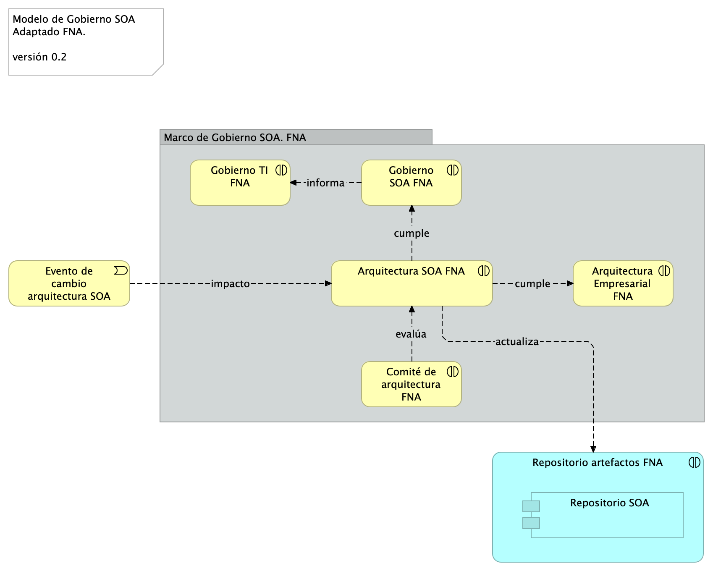
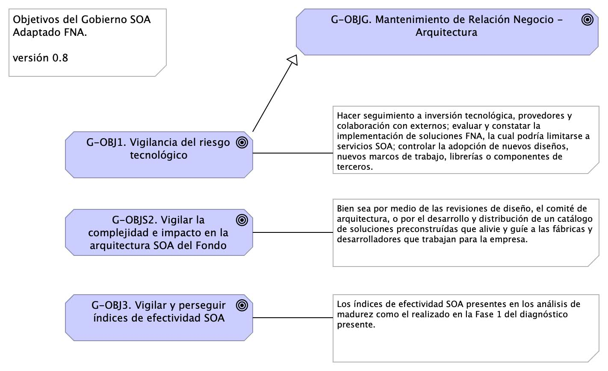
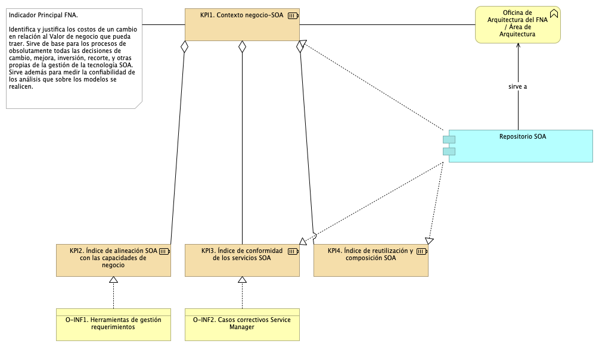
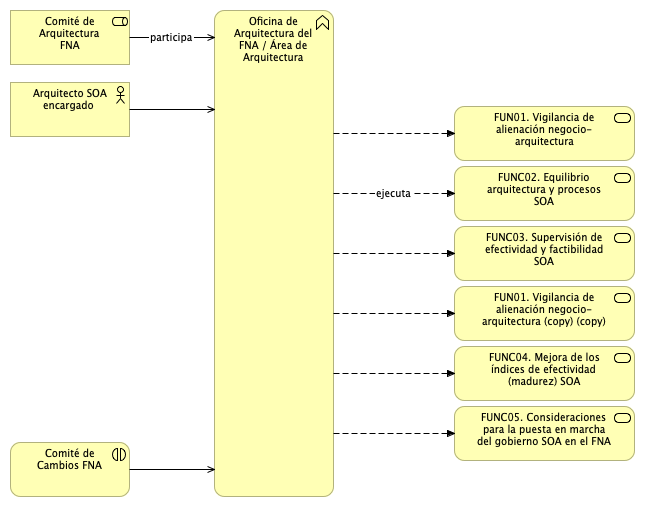

title: Modelo de Gobierno. Detalle de los recursos, herramientas, roles y participantes del gobierno SOA
geometry:
  - top=1in
  - bottom=1in
fignos-cleveref: True
fignos-plus-name: Fig.
fignos-caption-name: Imagen
tablenos-caption-name: Tabla
...

>    E-Service. Fase II
>
>    PRY01 Gobierno SOA. Contenido de los Productos Contractuales
>
>    Contrato 1812020
>
>    FNA, Stefanini
>
>    20 Jun 2023
>
>    **Versión** 1.45bac3b

 

# Producto 2: PR02. Modelo de Gobierno. Detalle de los recursos, herramientas, roles y participantes del gobierno SOA
Políticas y procedimiento, paquetes de trabajo, identificación de personas, roles y herramientas a desplegar a cargo de la oficina de arquitectura del FNA por concepto de la instauración del gobierno.

**Nota**: los análisis de este producto están dirigidos a cumplir los objetivos del proyecto PRY01, Gobierno SOA: desarrollo, gestión, gobierno de arquitectura y adopción.

 

## Justificación
El resultados del análisis de riesgos técnicos realizado en la Fase I de la consultoría E-Service, causados en parte por los retos de complejidad y agilidad que enfrenta el FNA, los cuales configuran una red de aplicaciones y servicios que aumenta el impacto, el esfuerzo y la incertidumbre de los cambios en las arquitecturas del Fondo, obliga a crear la oficina de arquitectua del FNA y a desplegar las mejoras en los flujos críticos de trabajo a cargo esta.

## Contenidos
1. Modelo de gobierno SOA del FNA: actores, información y procedimientos
1. Flujo de trabajo de oficina de arquitectura del FNA
1. Matriz de responsabilidades oficina de arquitectura
1. Procedimientos base del modelo de gobierno / oficina de arquitectura
1. Anexos. Referencia documental del Gobierno SOA del FNA

 

## Criterios de Aceptación
* Entendimiento funcional y operativa de la oficina de arquitectura FNA
* Matriz de roles y procedimientos de la oficina de arquitetura FNA

 

## Modelo de Implementación del PRY01
{#fig: width=lin}

_Fuente: Elaboración propia._

 

*** 

---
geometry:
  - top=1in
  - bottom=1in
fignos-cleveref: True
fignos-plus-name: Fig.
fignos-caption-name: Imagen
tablenos-caption-name: Tabla
...

| Tema           | Gobierno SOA del FNA: **Modelo de Gobierno y CCF**                                                            |
|----------------|---------------------------------------------------------------------------------------------------------------|
| Palabras clave | SOA, Contexto, Áreas, Procesos, Objetivos                                                                     |
| Autor          |                                                                                                               |
| Fuente         |                                                                                                               |
| Versión        | **1.45bac3b** del 20 Jun 2023                                                                          |
| Vínculos       | [Ejecución Plan de Trabajo SOA](onenote:#N001d.sharepoint.com); [Procesos de Negocio FNA](onenote:#N003a.com) |

 

# Antecedentes del Gobierno SOA del FNA
Los resultados de la consultoría E-Service, Fase I, 2022 señalan la _necesidad de manejo de la complejidad creciente en las soluciones del FNA_ (ver [Resultados E-Service, Fase I](https://stefaninilatam.sharepoint.com/SitePages/Home.aspx)). Sobre esa base, El Fondo Nacional del Ahorro estableció como pilar tecnológico la implementación obligatoria del Gobierno SOA, de forma tal, que preserve la continuidad de servicio y permita identificar y gestionar las amenazas y riesgos que impacten el desarrollo y evolución de las arquitecturas de software del Fondo, tarea base para los planes de alineación y puesta marcha de futuras soluciones y mejoras.

# Modelo de Gobierno SOA del FNA: Actores, Información y Procedimientos
El gobierno SOA del FNA, objeto de este proyecto, tiene impacto general en la empresa. Sin embargo, se desarrolla desde un centro condicionado por el alcance de este proyecto. Esta versión del Gobierno SOA del FNA nace en las partes e ítems de la arquitectura de software y de servicios del FNA consignadas en la vista de segmento de la empresa (ver Vista de Contextual, segmento de la empresa, [PR01. E-Service, Fase II](https://https://stefaninilatam.sharepoint.com/SitePages/Home.aspx/fna-dd-f2-pry1/manuscript.pdf)) pero no se agota ahí porque es necesario extenderlo a actores, interesados, usuarios y entidades relacionados con las partes de la arquitectura del FNA contenidas en la vista de segmento.

A cotinuación presentamos el modelo base de gobierno para el FNA, primera edición, versión 0.1. 

# Modelo de Gobierno SOA del FNA. Versión 0.2
La versión inicial del modelo de Gobierno SOA del FNA, propuesto en la Fase I de E-Service establece apenas las bases de lo que debe ser un marco de trabajo para gobierno SOA del FNA. Esta versión hace foco en un asunto general: _responder y gestionar la evolutición de la arquitectura de referencia SOA actual del Fondo Nacional del Ahorro_, y deja para siguientes versiones de este marco de trabajo de gobierno SOA la inclusión de otras problemáticas que demanden mayor gobierno.

{#fig: width=}

_Fuente: Diagnóstico SOA. E-Service (2022)._

 

# Modelo de Gobierno SOA del FNA. Versión 0.5
Ahora incorporamos en el modelo de gobierno del FNA el resultado del diagnóstico de susceptibilidad de gobierno realizado sobre los flujos críticos de trabajo elaborados en la Etapa 0 de este proyecto (ver [Flujos Críticos de Trabajo FNA]($(2:{https://stefaninilatam.sharepoint.com/SitePages/Home.aspx}))) con el fin de dar darle gestión a las problemáticas encontradas en dicho diagnóstico. El diagrama siguiente presenta el mopdelo de gobierno resultante. 

La nueva versión del modelo de gobierno del FNA incorpora las problemáticas encontradas en el producto 1 de este proyecto.

{#fig: width=}

_Fuente: Elaboración propia._

 

## Elementos del Modelo de Gobierno, versión 0.5
| Name                                  | Type                    | Description                                                                                                                                                                                                                                                                                                      | Properties |
|:--------------------------------------|:------------------------|:-----------------------------------------------------------------------------------------------------------------------------------------------------------------------------------------------------------------------------------------------------------------------------------------------------------------|:-----------|
| **Bitácora Arquitectura**             | application-component   |                                                                                                                                                                                                                                                                                                                  |            |
| **Documentación Técnica**             | application-component   |                                                                                                                                                                                                                                                                                                                  |            |
| **Modelo Arquitectura**               | application-component   |                                                                                                                                                                                                                                                                                                                  |            |
| **Repositorio Análisis**              | application-component   |                                                                                                                                                                                                                                                                                                                  |            |
| **Repositorio SOA**                   | application-component   |                                                                                                                                                                                                                                                                                                                  |            |
| **Arquitectura FNA
Mega**        | application-interaction |                                                                                                                                                                                                                                                                                                                  |            |
| **Especificaciones**                  | artifact                |                                                                                                                                                                                                                                                                                                                  |            |
| **Especificaciones**                  | artifact                | Métricas, Conclusiones, Decisiones.                                                                                                                                                                                                                                                                        |            |
| **ALS01. Complejidad**                | assessment              |                                                                                                                                                                                                                                                                                                                  |            |
| **ALS02. Impacto**                    | assessment              |                                                                                                                                                                                                                                                                                                                  |            |
| **ALS03. Costo / Beneficio**          | assessment              |                                                                                                                                                                                                                                                                                                                  |            |
| **Evento de cambio arquitectura SOA** | business-event          | Sucede un evento en que la arquitectura SOA, o alguna de los componentes de la arquitectura de referencia del FNA es imputado por un cambio. El cambio puede ser motivado por un requerimiento de arquitectura (TOGAF), una necesidad de negocio, o la adquisición de infraestructura (inversión de TI). |            |
| **Arquitectura Empresarial FNA**      | business-interaction    |                                                                                                                                                                                                                                                                                                                  |            |
| **Comité de Cambios FNA**             | business-interaction    |                                                                                                                                                                                                                                                                                                                  |            |
| **Comité de arquitectura FNA**        | business-interaction    |                                                                                                                                                                                                                                                                                                                  |            |
| **Gobierno TI FNA**                   | business-interaction    |                                                                                                                                                                                                                                                                                                                  |            |
| **Oficina Arquitectura FNA**          | business-interaction    |                                                                                                                                                                                                                                                                                                                  |            |
| **Caso Uso de Negocio**               | business-object         |                                                                                                                                                                                                                                                                                                                  |            |
| **Inversión TI**                      | business-object         |                                                                                                                                                                                                                                                                                                                  |            |
| **Requerimiento de Arquitectura**     | business-object         |                                                                                                                                                                                                                                                                                                                  |            |
| **Contrato de Gobierno SOA FNA**      | contract                |                                                                                                                                                                                                                                                                                                                  |            |
| **Decisión**                          | data-object             |                                                                                                                                                                                                                                                                                                                  |            |
| **Decisión Arq.**                     | data-object             |                                                                                                                                                                                                                                                                                                                  |            |

 

Este modelo de gobierno está diseñado para enfrentar el caso particular del FNA que es aumentar la relevancia de los de modelos de arquitectura, que funcionen como lenguaje común entre los autores y actores, y la graduación del uso del repositorio de artefactos de arquitectura e ingeniería. En este modelo de gobierno, v0.5 que diseñamos para la empresa, _el repositorio de arquitectura es el corazón del gobierno_; lo mismo para la oficina del arquitectua del FNA. Es también la base de los análisis de ingeniería que se comparten con proveedores y contratistas del Fondo Nacional del Ahorro.

El requerimiento de arquitectura, sea un Caso de Uso (nivel 0: negocio), una inversión de TI, sea adquisición, migración, consultoría (nivel 1:incidencia), o un requierimiento no funcional (nivel 2:ingeniería), es la entrada principal del modelo de gobierno. 

Una vez definido esta nueva versión del modelo de gobierno del FNA, y descrito sus elementos, debemos dotarlo de un sentido operativo. Esto se hace mediante la declaración de las funciones y objetivos del gobierno a los que este modelo debe ceñirse y responder. De igual manera, los roles que constituyen la oficina de arquitectura del FNA.

 

---
geometry:
  - top=1in
  - bottom=1in
fignos-cleveref: True
fignos-plus-name: Fig.
fignos-caption-name: Imagen
tablenos-caption-name: Tabla
...

| Tema           | Modelo de Gobierno SOA. v0.5: **Objetivos del Gobierno** |
|----------------|--------------------------------------------------------------------------------|
| Palabras clave | SOA, Contexto, Áreas, Procesos, Objetivos                                      |
| Autor          |                                                                                |
| Fuente         |                                                                                |
| Versión        | **1.45bac3b** del 20 Jun 2023                                           |
| Vínculos       | [Ejecución Plan de Trabajo SOA](onenote:#N001d.sharepoint.com); [Procesos de Negocio FNA](onenote:#N003a.com)|

 

### Objetivo Principal del Gobierno SOA del FNA
Una vez identificadas estas problemáticas existentes en la empresa FNA, y que podemos resumir en 1) riesgo tecnológico, 2) complejidad y 3) nivel de formalización de la arquitectura dentro de los desarrollos e implementaciones del FNA, el gobierno SOA propuesto para el Fondo, versión 0.5, tiene un objetivo general que es el siguiente

> El gobierno SOA es el vigía de las relaciones entre las áreas de negocio (la vicepresidencia de operaciones y la vicepresidencia de crédito del FNA) y la implementación y diseño de soluciones SOA. El gobierno SOA del Fondo debe asistir en la aplicación y ejecución de un régimen (estándar) de implementación, observación y puesta en marcha de soluciones SOA.

{#fig:objetivos-id width=}

_Fuente: Elaboración propia._

 

Para sustentar este objetivo general, que puede resumirse en "mantener y gestionar la relación de negocio con la arquitectura TI del FNA", debemos consignar objetivos específicos, tales que sean asignables y responsabilizables a los actores principales del gobierno v0.5. Estos objetivos específicos, como mínimo, son los que describimos a continuación.

### Objetivos Específicos del Gobierno
Los objetivos asignables a los roles constituyentes de la oficina de arquitectura del FNA que garantizan el cumplimiento del objetivo general del gobierno son los siguientes.

1. G-OBJ1. Vigilancia del riesgo tecnológico
1. G-OBJ2. Vigilar el crecimiento de la complejidad y el impacto de los nuevos cambios en la arquitectura SOA del FNA
1. G-OBJ3. Vigilar y perseguir el aumento de los índices de adopción, adaptación y efectividad SOA

 

Los objetivos princiapl y específicos se encuentran ilustrados arriba, en la imagen _Objetivos principal y específicos del Gobierno SOA del FNA_, arriba @fig:objetivos-id. A continuación trataremos detalles de cada objetivo específico.

#### G-OBJ1. Vigilancia del Riesgo Tecnológico
La definición de riesgos tecnológico que perseguimos en este ejercicio de diseño de gobierno SOA tiene que ver únicamente con los dominios de arquitectura[^1], a los que estos impacten. Esta clasificación de los riesgos técnicos, y para efectos del ejercicio de gobierno objeto de este proyecto, es eficaz porque le facilita a cada arquitecto focalizar y mitigar aquellos riesgos relacionados con su dominio particular, que en este contexto consideramos como dominios de arquitectura a: servicios, aplicaciones, datos e infraestructura. Los riesgos transversales, como los causados por la deuda técnica, los clasificaremos en el dominio de servicios.

Una vez organizado slos riegos técnicos por dominio, cada uno deberá: hacer seguimiento a la inversión tecnológica, la cual involucra a los provedores del FNA y colaboración con externos; segundo, evaluar y constatar la implementación de herramientas de software, la cual podría limitarse a servicios SOA; y finalmente, controlar la adopción de nuevos diseños, nuevos marcos de trabajo, librerías o componentes de terceros.

   De este objetivo enfatizamos el control sobre la inversión de TI, que en la práctica trata sobre vigilar la efectividad y factibilidad de los proyectos SOA de la organización mediante los resultados del 
   1. análisis de factibilidad SOA
   1. y la efectividad esperada de la inversión (cálculo del costo / beneficio)
   
   Ambos análisis deben quedar relacionados en el repositorio de la oficina de arquitectura del FNA, objeto de este proyecto.

[^1]: TOGAF 9.1. Risk Management (2023): En https://pubs.opengroup.org/architecture/togaf9-doc/arch/chap27.html

##### Niveles de Riesgo Técnico para del FNA
Aún cuando tengamos la clasificación de riesgos técnicos, requerimos contar con niveles de criticidad a los riesgos técnicos (organizados por dominio de arquiteura). Los niveles que consideramos pertinentes para este trabajo de gobierno SOA del FNA son riesgo de nivel inicial y nivel residual.

La definición de cada nivel de riesgo es como sigue.
* Riesgo Técnico Inicial: nivel de riesgo al momento de su identificación en las arquitecturas del FNA. El riesgo permanece en este nivel antes y durante la implementación de las acciones de mitigación.
* Riesgo Técnico Reisudal: este nivel que toma el riesgo técnico luego de la implementación de las acciones de mitigación. 

#### G-OBJS2. Vigilar la Complejidad e Impacto en la Arquitectura SOA del Fondo
Una de las mayores limitaciones para diseñar soluciones para los sistemas de información, aplicaciones y herramientas de software es tener las habilidades y herramientas para entenderlos (antes de diseñar). A medida que los sistemas, y los programas debajo de estos, evolucionan y adquieren más características, los sistemas y las aplicaciones de software se vuelven complicados, con sutiles y crecientes dependencias entre sus componentes. Con el tiempo, la complejidad se acumula, y se vuelve cada vez más difícil para los ingenieros y desarrolladores, el mantener organizado (y en su conocimiento) todos los factores relevantes de la implementación mientras se encargan de modificar los sistemas. Esto ralentiza el desarrollo y conduce a fallos, que a su vez aumenta la lentitud del desarrollo agregandole costos al proceso. La complejidad incrementa inevitablemente. Mientras más componentes tenga el sistema (tamaño) y más personas trabajen en él (actores), mayor la dificultad para manejar la complejidad.

Desarrollar las habilidades y herramientas para representar, organizar y divulgar las ideas funcionales y sus detalles de implementación es lo que llamamos gestionar la complejidad en este contexto.

#### G-OBJ3. Vigilar y Alcanzar los Índices de Efectividad SOA
Para el modelo de gobierno del FNA vamos a utilizar dos sistemas de índices de rendimiento. Para el primero, equiparamos la definición de efectividad de arquitectura con el modelo de madurez OSIMM de TOGAF. A partir de ahí, desarrollaremos los índices sujetos de este objetivo. En este sentido, tomaremos como referencia la versión inicial de estos índices desarrolados en los análisis de madurez realizado en E-Service, Fase 1. A saber:

{#fig: width=}

_Fuente: Diagnóstico SOA. E-Service (2022)._

 

Es deber de este objetivo establecer y desplegar los procedimientos para garantizar el aumento de estos índices de efectividad, así como monitorear el rendimiento (KPI) de los procesos de arquitecura involucrados y definidos más adelante.

El segundo sistema de índices que utilizaremos es el desarrollado por la Fase I de E-Service. En este, establecemos como indicador clave _que el FNA mantenga el vínculo de sus activos tanto de infraestructura como los activos SOA con el contexto de negocio de las vicepresidencias de Operaciones y de Crédito_. Esto es, el principal indicador del gobierno SOA es la existencia y la vigencia de los vínculos entre los contextos de negocio y la arquitectura de referencia SOA FNA, y su tecnología.

Este solo indicador del gobierno SOA, el del vínculo de los contextos negocio-tecnología SOA, que es útil también para otras disciplinas de gestión TI, _identifica y justifica los costos de un cambio en relación al Valor de negocio que pueda traer_. Sirve además de base para los procesos la mayoría de las decisiones de cambio, mejora, inversión, reforma, y otras propias de la gestión de la tecnología SOA. También funciona para medir la confiabilidad de los análisis que sobre los modelos se realicen. _Es por estas razones que para el Fondo este es el principal indicador de gobierno SOA a desarrollar_.

De todos los indicadores de gestión del gobierno, el del Vínculo Contexto Negocio-SOA es el más importante para el FNA. Para mantener el puntaje de este indicador alto debe recurrir a la actualización y mantenimiento del repositorio de arquitectura. En la medida en que este repositorio capture la mayor cantidad de información de los contextos referidos, el indicador aumentará, a la vez que el repositorio será un activo clave para todas las opeaciones de gestión de TI del FNA.

{#fig: width=}

_Fuente: Diagnóstico SOA. E-Service (2022)._

 

### Otros Objetivos del Gobierno SOA
Para complementar la lista de objetivos específicos del gobierno SOA, v0.5, del FNA, la lista siguiente expone objetivos suplementarios, o que aplican bajo ciertas condiciones o relaciones con otros proyectos transformadores, como la Arquitectura Empresarial, transformación digital, arquitectura de negocio, entre otros.

1. Desde el área, o rol, de gobierno SOA del FNA, servir de guía en la entrega de soluciones de software conforme a la arquitectura de referencia estregada por esta consultoría.
1. Informar de desviaciones en la relación de efectividad de costos de los proyectos SOA del FNA en términos del área de inefectividad de costo e infactibilidad SOA.
1. Hacer el seguimiento de las implementaciones de los cambios en la arquitectura de referencia: phase G, Implementation Governance, TOGAF ADM.

 

La imagen siguiente preesenta el conjunto de objetivos principales y secundarios que el Gobierno SOA del FNA, versión 0.5, debe perseguir y cumplir. 

{#fig: width=}

_Fuente: Diagnóstico SOA. E-Service (2022)_

 

| Tema           | Modelo de Gobierno SOA. v0.5: **Capacidades del Gobierno** |
|----------------|--------------------------------------------------------------------------------|
| Palabras clave | SOA, Contexto, Áreas, Procesos, Objetivos                                      |
| Autor          |                                                                                |
| Fuente         |                                                                                |
| Versión        | **1.45bac3b** del 20 Jun 2023                                           |
| Vínculos       | [Ejecución Plan de Trabajo SOA](onenote:#N001d.sharepoint.com); [Procesos de Negocio FNA](onenote:#N003a.com)|

 

### Capacidades FNA por Desarrollar para el Gobierno SOA
Las capacidades requeridas por el gobierno SOA del Fondo, que a la vez soportan a la matriz de roles y responsabilidades (RACI) del equipo de gobierno SOA, desarrolama más adelante en este producto, están relacionados directamente con los objeitvos del gobierno SOA y con los riesgos tecnológicos encontrados en la Fase 1 de E-Service (ver [06a.Objetivos gobierno](N03a%a20Vsta%20aSegenta%20SOA%20FNA.md), y [06c.Riesgos tecnológicos SOA](N03a%a20Vsta%20aSegenta%20SOA%20FNA.md)).

 

>**Nota**: si bien algunas capacidades se realizan mediante la oficina de arquitectura, no es del alcance de esta consultoría, E-Service, Fase II (contrato 181-2020), desarrollarlas todas. Es del alcance enunciarlas como requeridas y considerarlas en esta versión de gobierno SOA, v0.5, objeto de este proyecto. Desarrollar la completitud de estas capacidades de negocio requeriría, similar a cualquier otra capacidad del FNA, la ejecución de otro(s) proyecto de índole de capital humano.

{#fig: width=}

_Fuente: Diagnóstico SOA. E-Service (2022)._

 

1. CAP01. Realizar e implementar estrategias y entregables para planear y analizar la arquitectura de referencia SOA del Fondo (resultado Fase 2 de este diagnóstico). Esta capacidad se realiza mediante el flujo _Colaboración Modelado con Proveedores_ (FLUJ02) de trabajo de la oficina de arquitectura del FNA.

1. CAP02. Relacionar elementos de la arquitectura de referencia SOA (181-2020), esto es, procesos de negocio, servicios, datos, aplicaciones, componentes, tecnologías, etc., y vincular distintas perspetivas a una vertical de negocio del  Fondo, como, Gestión Comercial, Cesantías, Ahorro Voluntario para desarrollar modelos consistentes y desarrollar la oportunidad de dirigir cambios y atacar los problemas de integralidad de las pruebas. Esta capacidad se realiza mediante el flujo _Colaboración Modelado con Proveedores_ (FLUJ02) de trabajo de la oficina de arquitectura del FNA.

1. CAP03. Realizar y gestionar la puesta en marcha de hojas de ruta para cerrar brechas y alcanzar estados futuros de la arquitectura (TOGAF 9, Fase G, Implementation governance). Esta capacidad se realiza con la puesta en marcha de la oficina de arquitectura del FNA.

1. CAP04. Ejercitar la trazabilidad de los activos y productos de TI con los productos y decisiones de negocio de las áreas del FNA, como la vicepresidencia de Crédito y la de Operaciones ante la llegada de impactos, cambios, reformas y bajas tecnológicas. Esta capacidad se realiza con la puesta en marcha de la oficina de arquitectura del FNA.

1. CAP05. Realizar análisis de impacto, riesgos, costo beneficio, capacidad usada, y gestión de demanda ante la evaluación de cambios a la arquitectura de referencia SOA y activos de TI, cuando lo amerite. Esta capacidad se realiza, en parte, mediante el flujo _Colaboración Modelado con Proveedores_ (FLUJ02) de trabajo de la oficina de arquitectura del FNA, y con la colaboración de los arquitectos de fábricas y proveedores.

1. CAP06. Emitir y gestionar los contenidos de documentación técnica, como principios, restricciones tecnológicas, marcos de trabajo, normas, diseños, y estándares para el uso de los proveedores, servicios de fábricas del FNA, planta interna, Comunicación y Planeación. Esta capacidad se realiza, en parte, con la puesta en marcha de la oficina de arquitectura del FNA.

1. CAP07. Emitir y actualzar el marco de trabajo de gobierno SOA que complemente el de TI del Fondo y que enuncie los procesos, procedimientos y responsabilidades de este con el fin de generar la autoridad y asistir en la toma de deciones internas (áreas de TI y Planeación del Fondo) y externas (proveedores del Fondo). Esta capacidad se realiza, en parte, con la puesta en marcha de la oficina de arquitectura del FNA.

 

## Anexo 1. Susceptibilidades de Gobierno (PR01) 
1. Debilidad en la Completitud de los CU
1. Herramientas y Métodos de QA relacionados con sistemas distribuidos y QA​
1. Normalización y fortalecimiento de los ambientes QA ​
1. Gestión del diseño y arquitecturas: categorización de complejidad​
1. Correspondencia complejidad - diseño
1. Débil (o inexistente) procedimiento de evaluación de inversión​
1. Débil (o inexistente) formalidad para el cálculo de eficacia un inversión​ TI, proveedores
1. Normnalizar registro de resultados de las entregas de proveedores​ (confiabilidad)
1. Asignación de responsables de gestión de las inversiones de TI

 

## Anexo 2. Riesgos Técnicos FNA (E-Service, 2022)
* R01. Riesgo de agilidad limitada (ver imagen 1)
* R02. Riesgo de baja orquestación SOA (ver imagen 2a y 2b)
* R03. Riesgo de crecimiento de dependencias entre servicios SOA
* R04. Riesgo de crecimiento de adaptadores particulares –opuesto al estándar– (ver imagen 3)
* R05. Riesgo de baja reutilización de servicios SOA
* R06. Riesgo de permanencia de aplicaciones silos
* R07. Riesgo de falta de trazabilidad para la evolución e implementación de los servicios SOA

## Anexo 3. Proceso de Arquitectura Empresarial

{#fig: width=}

_Fuente: www.opengroup.org/soa/source-book/togaf._

 

***

---
geometry:
  - top=1in
  - bottom=1in
fignos-cleveref: True
fignos-plus-name: Fig.
fignos-caption-name: Imagen
tablenos-caption-name: Tabla
...

| Tema           | Modelo de Gobierno SOA. v0.5: **Flujos de Trabajo Oficina de Arquitectura** |
|----------------|--------------------------------------------------------------------------------|
| Palabras clave | SOA, Contexto, Áreas, Procesos, Objetivos, Flujo de trabajo                    |
| Autor          |                                                                                |
| Fuente         |                                                                                |
| Versión        | **1.45bac3b** del 20 Jun 2023                                           |
| Vínculos       | [Ejecución Plan de Trabajo SOA](onenote:#N001d.sharepoint.com); [Procesos de Negocio FNA](onenote:#N003a.com)|

 

# Flujos de Trabajo Oficina de Arquitectura
Desarrollamos dos flujos fundamentales de la oficina de arquitectura. El primero, el FLUJ01. Diseño y Análisis de Modelos de Arquitectura del FNA, se ejecuta cada vez que exista una petición de requerimiento de cambio de arquitectura. Los demás pasos de este flujo se resumen a continuación.

1. Recibe el requerimiento de arquitectura
    * Inicia el proceso ADM - Fase de preliminar: alistamiento y aprobación​
    * Arranca el modelado​ inicial o incremental, nivel 100 [^1]
2. El arquitecto de solución continúa el proceso ADM - solicita implementación / gobierno

[^1]: Niveles de detalle de la ingeniería: https://editeca.com/lod-nivel-de-desarrollo/

 

La siguiente imagen ilustra los pasos descritos.

{#fig: width=}

_Fuente: Elaboración propia._

 

Una variante del flujo de trabajo arquitectura ADM, y más sgnificativa para el FNA, incorpora los tipos de análisis que se deben llevar a cabo, como exigencia del gobierno que estamos instalando.

1. El Arq. FNA recibe el requerimientos de cambio
1. Inicia el proceso ADM - fase de preliminar: alistamiento y probación
1. Inicia el modelado
    1. Diseño
        1. Inicia diseño conceptual (nivel 100): appl, datos, TI, servicios, inversión
        1. Bloques de construcción abstractos
    1. Solución
        1. Bloques de construcción de solución
        1. Solicita diseño detallado (nivel 200, 300, 400 o 500) de los dominios de arquitectura: aplicaciones, datos, infraestructura y servicios
1. El Arquitecto FNA inicia los análisis mínimos
    1. Análisis de impacto
    1. de Complejidad
    1. y Costo / beneficio
1. El Arquitecto FNA (de la oficina de arquitectura) solicita al arquitecto de solución, sea de proveedor interno o externo, el inicio del Proceso ADM - fase de implementación y fase de gobierno
    1. El arquitecto de solución modela los bloques de solución [^2]

1. El Arquitecto FNA inicia la creación de contenidos y _documentación técnica_
    
       Nota. Otros análisis exigibles también a los arquitectos de solución: Plan de cambios, Estimación, Estructural.

[^2]: ABB y CBB, TOGAF 9.1. Características generales. En https://pubs.opengroup.org/architecture/togaf9-doc/arch/chap33.html.

Los bloques de solución a los que nos referimos en el paso del arquitecto de solución son paquetes de funcionalidad definidos por necesidades de negocio o del arquitecto. Pueden ser cualquier clasificador (objeto tipo) correspondiente al modelo de contenidos de la empresa, como por ejemplo, actores, servicios, aplicaciones, o entidades de datos. Representan un único concepto que tiene límites claros y es reconocible como 'parte' en un dominio de la arquitectura. Puede o no interoperar con otros bloques. Es importante que un bloque de construcción tenga una implementación y un uso. Debe además evolucionar mediante la tecnología. 

Los bloques de solución pueden estar compuesto por otros (ensamblado), y por tanto, puede ser descompuesto (desensamblado) en los bloques pequeños que los constituyen. Es obligatorio que sea reutilizable, reemplazable, y especificado a conformidad.

Los sistemas y herramientas de software de la arquitectura del FNA deben estar creados a partir de colecciones de bloques de solución. De ahí que estos bloques deban tener una interfaz de interacción clara y estable para con otros bloques. 

Lo más importante de estos bloques es que son los que contienen los niveles de detalle (100 al 500). Por ejemplo, a nivel 100, el arquitecto del FNA podría dar comiezo al modelado de un bloque de solución mediante un nombre, una descripción o un esquema. Luego, el arquitecto de solución, puede descomponer este mismo bloque en múltiples construcciones acompañada de una especificación más detallada (nivel 200 al 500).

En la siguiente imagen ilustramos esta variante del flujo de trabajo de la oficina de arquitectura del FNA.

{#fig: width=}

_Fuente: Elaboración propia._

 

---
geometry:
  - top=1in
  - bottom=1in
fignos-cleveref: True
fignos-plus-name: Fig.
fignos-caption-name: Imagen
tablenos-caption-name: Tabla
...

| Tema           | Modelo de Gobierno SOA. v0.5: **Funciones del Gobierno y Matriz de Responsabilidades** |
|----------------|--------------------------------------------------------------------------------|
| Palabras clave | SOA, Contexto, Áreas, Procesos, Objetivos                                      |
| Autor          |                                                                                |
| Fuente         |                                                                                |
| Versión        | **1.45bac3b** del 20 Jun 2023                                           |
| Vínculos       | [Ejecución Plan de Trabajo SOA](onenote:#N001d.sharepoint.com); [Procesos de Negocio FNA](onenote:#N003a.com)|

 

# Funciones del Gobierno SOA del FNA
Las funciones que vamos a definir para el gobierno SOA del FNA, entendidas como responsabilidades de la oficina de arquitectura, están dirigidos a las problemáticas encontradas en la Fase I. Estos son, a saber: 

*     Dado los niveles de complejidad que el FNA ha alcanzado y por los riesgos tecnológico que contraen las partes analizadas en la Fase 1 de este diagnóstico (...)
*     De las problemáticas encontradas en la Fase 1 del presente diagnóstico, (...))explícitamente a las que incrementan la complejidad de las soluciones tecnológicas y de software del FNA, _como lo es el manejo de dependencias de los servicios SOA del Fondo_. Es muy conocido que esta condición es la causa de la mayoría de los sobreesfuerzos en los cambios y de las dificultades a la hora de predecir su impacto.
*     (...) Estas complicaciones, que denotan un débil gobierno preexistente, se encuentran otras que fueron levantadas en la Fase 1 del diagnóstico E-Service: - Agilidad limitada, - Complejidad e imprecisión, en la trazabilidad, - Ocultamiento de funcionalidades.

 Ver [Resumen de Fase 1](N03a%a20Vsta%20aSegenta%20SOA%20FNA.md).

 

## Funciones de Gobierno FNA: Oficina de Arquitectura
Las condiciones preexistentes en el FNA indicadas arriba definen el contexto en el cual debe operar, y el que hay que enfrentar con el nuevo gobierno SOA del FNA, versión 0.5. Para enfrentar este contexto requerimos antes lo que llamaremos funciones del gobierno, y que estas sean explícitas para el contexto del FNA. Estas funciones deben tener un corresponsal directo, y este es la oficina de arquitectura del FNA (LOAF), dado que esta es la que las debe ejecutar. Por tanto, el modelo de gobierno FNA, v0.5, propuesto arriba, _viene a jugar el rol del sistema u órgano operativo del que la oficina de arquitectura es el órgano ejectivo de este gobierno_.

Para darle realización a todo el modelo de gobierno (el sistema operativo de la oficina) necesitamos en primer lugar que la oficina funcione de una manera particular. Esto es, la oficina debe ejecutar funciones claras y entregar el resultado de estas a quienes se las solicitan. Vamos a definir tres funcones fundamentales que, desde el gobierno, la oficina de arquitectura del FNA (LOAF) debe realizar con modalidad diaria. 

Estas funciones son operaciones esperadas por aquellos con los que la oficina de arquitectura se relacione. Vienen siendo la interfaz de la oficina expuesta a terceros, y que estos pueden utilizar o requerir de los arquitectos.

{#fig: width=}

_Fuente: Elaboración propia._

 

En la imagen muestra que estas funciones operativas juegan el rol de interfaz de entrada para quien demande una respuesta (salida) de la oficina. Las funciones se complementan de solicitudes específicas que actúan a su vez como contratos de la interfaz de la oficina. Estas funciones se explican se la siguiente manera.

1. Centralizar. La funciónd e centralizar se ocupa de reunir y gestionar la versión única de los productos de trabajo, y de la información, que posee la ofcina. Ejemplo, las decisiones de arquitectura. Es deber del área de arquitectura del FNA centralizar la autoría y gestión de este tipo de infomación. De igual manera se entiende esta función con otro ejemplo o tipo de información a centralizar: los modelos.

1. Diagnosticar / Solución (modelar). La función de diagnósticar y modelar una solución es la función central de la oficina. Se debe a que todos los resultados que la oficina produce están basados en modelos, y en hechos objetivos, alejándose de la habitual intuición y el juicio apresurado.

1. Distribuir (compartir). La función de distribuir (que equivale a la función de compartir) es la gestión de las entrega de los productos de trabajo y resultados de las funciones anteriores.

 

## Responsabilidades de la Oficina de Arquitectura
Las responsabilide que el gobierno del FNA debe exigir, y que la oficina de arquitectura del FNA debe realizar, son:

* FUNC01. Vigilancia de alienación negocio-arquitectura
* FUNC02. Equilibrio arquitectura y procesos SOA
* FUNC03. Supervisión de efectividad y factibilidad SOA
* FUNC04. Mejora de los índices de efectividad (madurez) SOA
* FUNC05. Consideraciones para la puesta en marcha del gobierno SOA en el FNA

 

En una vista de conjunto, queremos presentar el hecho de que las funciones de gobierno, en tanto que acciones, cendrán a convertirse en las responsabilidades que los integrantes del área de arquitectura del FNA deben cumplir. En la imagen siguiente dejamos explícitos estas responsabilidades.

{#fig: width=}

_Fuente: Elaboración propia._

 

### Equilibrio arquitectura y procesos SOA

### Supervisión de efectividad y factibilidad SOA

### Mejora de los índices de efectividad (madurez) SOA

### Consideraciones para la puesta en marcha del gobierno SOA en el FNA

***

## Referencias {.page_break_before}
<!-- Explicitly insert bibliography here -->

E-Service. Situación SOA Actual del FNA. Etapa I. (2022).

E-Service. Arquitectura de Referencia del FNA. Etapa II. (2023).

E-Service. Hoja de Ruta e Iniciativas. Etapa III. (2023).

TOGAF 9.1. Risk Management (2023). En https://pubs.opengroup.org/architecture/togaf9-doc/arch/chap27.html

